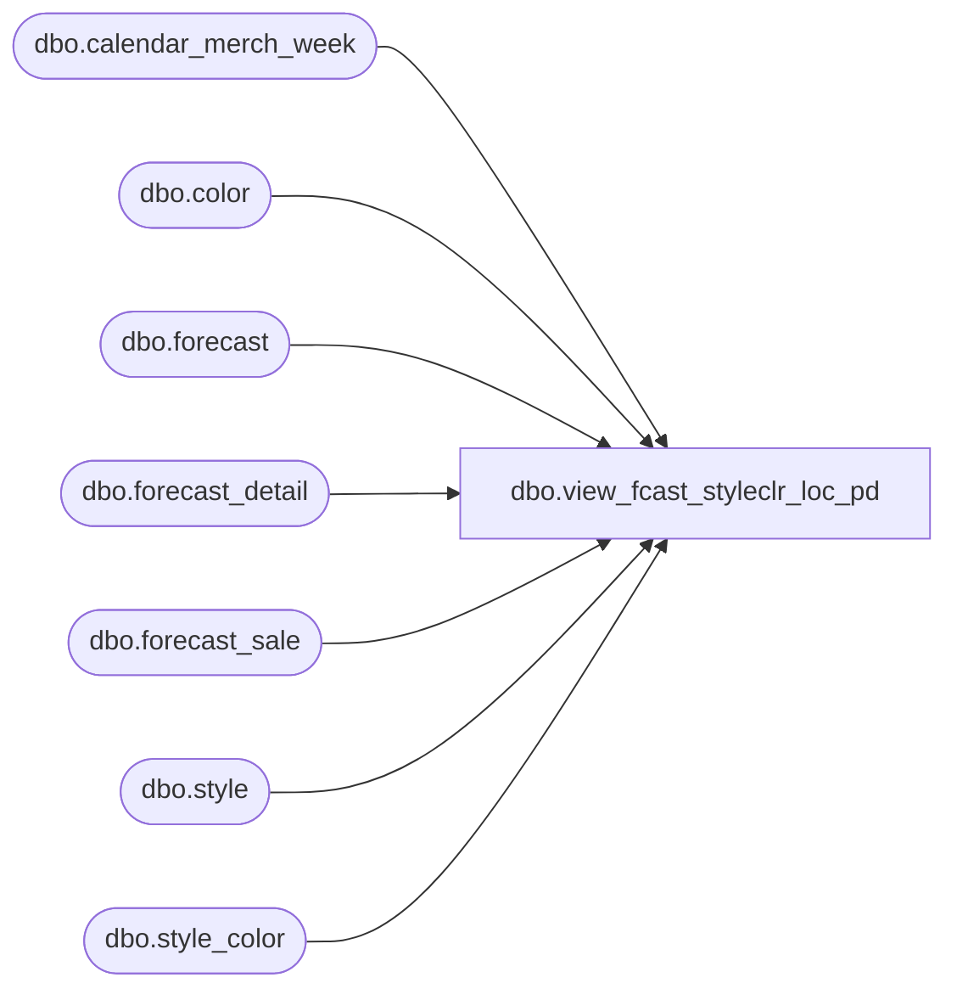

# dbo.view_fcast_styleclr_loc_pd

**Database:** ma_01  
**Server:** bedrockdb02  

## Architecture Diagram



## Table Dependencies

| Referenced Table |
|---|
| dbo.calendar_merch_week |
| dbo.color |
| dbo.forecast |
| dbo.forecast_detail |
| dbo.forecast_sale |
| dbo.style |
| dbo.style_color |

## View Code

```sql
CREATE view dbo.view_fcast_styleclr_loc_pd AS
SELECT DISTINCT
		c.forecast_id,
		c.forecast_detail_id, 
		c.location_id,
		c.forecast_run_date,
		c.style_id,
       		c.color_id,
		(cm.merch_year *100 +cm.merch_period) merch_year_pd,
		SUM(c.forecast_error) forecast_error,
		SUM(c.safety_stock) safety_stock,
		SUM(c.forecast_value) forecast_value,
		SUM(c.adjustment_factor) adjustment_factor
FROM
(	
	SELECT DISTINCT 
		fs.forecast_id,
		fs.forecast_detail_id,
		fd.location_id, 
		b.max_forecast_run_date AS forecast_run_date,
		b.style_id, 
		b.color_id, 
		b.style_color_id,
		(cw.merch_year *100 +cw.merch_week) AS merch_year_wk,
		fs.adjustment_factor, 
		fs.forecast_value, 
		fs.forecast_error, 
		fs.safety_stock
FROM forecast f 
INNER JOIN
	(
		SELECT 
		a.location_id, 
		a.run_date_no_time,
		max(a.forecast_run_date) max_forecast_run_date,
		a.style_id, 
		a.color_id, 
		a.style_color_id
		FROM 
			(SELECT DISTINCT 
					f.forecast_id,
					fd.forecast_detail_id,
					fd.location_id, 
					convert(smalldatetime,convert(varchar, f.forecast_run_date,101)) AS run_date_no_time,
					f.forecast_run_date,
					s.style_id, 
					r.color_id,
					fd.style_color_id
			FROM forecast f 
			INNER JOIN forecast_detail fd ON f.forecast_id = fd.forecast_id 
			INNER JOIN style_color sc ON fd.style_color_id IS NOT NULL AND fd.style_color_id = sc.style_color_id
			INNER JOIN style s ON s.style_id = sc.style_id
			INNER JOIN color r ON r.color_id = sc.color_id
			) a
		GROUP BY 
		a.location_id, 
		a.run_date_no_time,
		a.style_id, 
		a.color_id,
		a.style_color_id 
	) b ON f.forecast_run_date = b.max_forecast_run_date
	INNER JOIN forecast_detail fd ON f.forecast_id = fd.forecast_id AND fd.style_color_id IS NOT NULL AND fd.style_color_id = b.style_color_id AND fd.location_id = b.location_id
	INNER JOIN forecast_sale fs ON fd.forecast_detail_id = fs.forecast_detail_id
	INNER JOIN calendar_merch_week cw ON cw.calendar_week_id = fs.calendar_week_id
) c
INNER JOIN calendar_merch_week cm on c.merch_year_wk =(cm.merch_year *100 +cm.merch_week)
GROUP BY
	c.forecast_id,
	c.forecast_detail_id,
	c.location_id,
	c.forecast_run_date,
	c.style_id,
	c.color_id,
	(cm.merch_year *100 +cm.merch_period)
```

