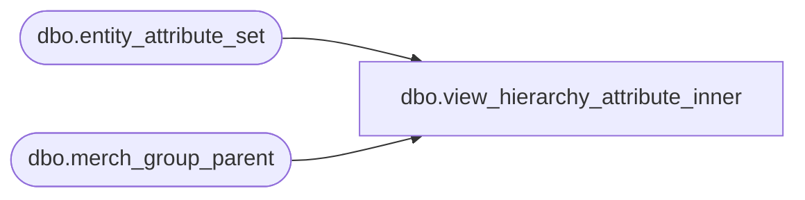

# dbo.view_hierarchy_attribute_inner

**Database:** ma_01  
**Server:** bedrockdb02  

## Architecture Diagram



## Table Dependencies

| Referenced Table |
|---|
| dbo.entity_attribute_set |
| dbo.merch_group_parent |

## View Code

```sql
create view dbo.view_hierarchy_attribute_inner AS 
select distinct m.parent_hierarchy_group_id, v.attribute_set_id,
       v.attribute_id
from merch_group_parent m, 
(select m.hierarchy_group_id, attribute_set_id, attribute_id
from entity_attribute_set e, merch_group_parent m
where e.parent_type = 5 and e.parent_id = m.parent_hierarchy_group_id
and hierarchy_level_id = (select max (hierarchy_level_id) 
			from entity_attribute_set e1, merch_group_parent m1
			where e1.parent_type = 5 
                        and e1.parent_id = m1.parent_hierarchy_group_id
			and e.attribute_id = e1.attribute_id
			and m.hierarchy_group_id = m1.hierarchy_group_id ))v  
where v.hierarchy_group_id = m.hierarchy_group_id
```

