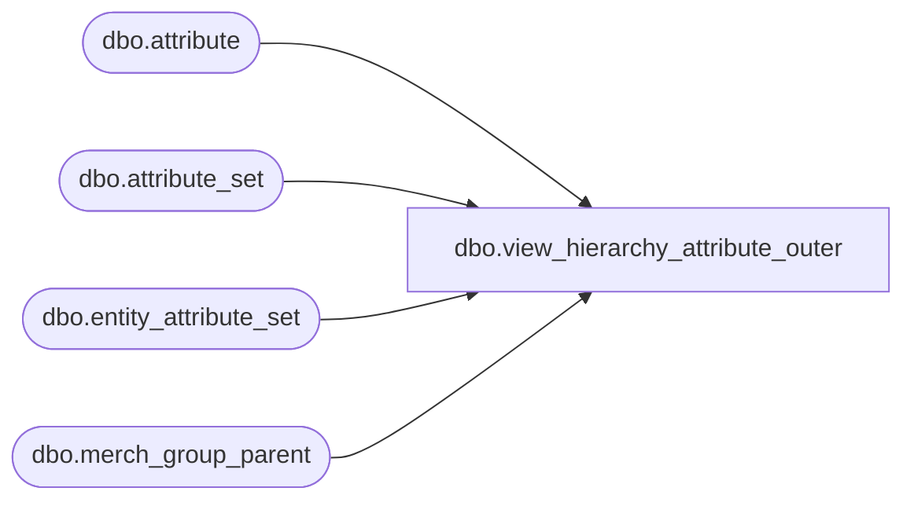

# dbo.view_hierarchy_attribute_outer

**Database:** ma_01  
**Server:** bedrockdb02  

## Architecture Diagram



## Table Dependencies

| Referenced Table |
|---|
| dbo.attribute |
| dbo.attribute_set |
| dbo.entity_attribute_set |
| dbo.merch_group_parent |

## View Code

```sql
create view dbo.view_hierarchy_attribute_outer AS 

select g.parent_hierarchy_group_id, 
{fn IFNULL(a.attribute_set_id,-1)} attribute_set_id, 
a.attribute_set_code, 
a.attribute_set_label, 
g.attribute_id
from
(select distinct m.parent_hierarchy_group_id, v.attribute_set_id,
 s.attribute_set_code, s.attribute_set_label,  v.attribute_id
 from merch_group_parent m, 
(select m.hierarchy_group_id, attribute_set_id, attribute_id
 from entity_attribute_set e, merch_group_parent m
 where e.parent_type = 5 and e.parent_id = m.parent_hierarchy_group_id
 and hierarchy_level_id = (select max (hierarchy_level_id) 
			from entity_attribute_set e1, merch_group_parent m1
			where e1.parent_type = 5 
                        and e1.parent_id = m1.parent_hierarchy_group_id
			and e.attribute_id = e1.attribute_id
			and m.hierarchy_group_id = m1.hierarchy_group_id ))v,
 attribute_set s
where v.hierarchy_group_id = m.hierarchy_group_id
and v.attribute_set_id = s.attribute_set_id) a
RIGHT JOIN 
( SELECT DISTINCT 
a.parent_hierarchy_group_id, 
NULL attribute_set_id, 
e.attribute_id 
FROM attribute e ,merch_group_parent a 
where e.attribute_type=5) g 
on 
a.parent_hierarchy_group_id = g.parent_hierarchy_group_id 
and (a.attribute_id = g.attribute_id 
or a.attribute_id is NULL)
```

