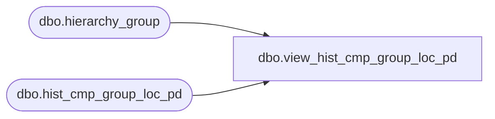

# dbo.view_hist_cmp_group_loc_pd

**Database:** ma_01  
**Server:** bedrockdb02  

## Architecture Diagram



## Table Dependencies

| Referenced Table |
|---|
| dbo.hierarchy_group |
| dbo.hist_cmp_group_loc_pd |

## View Code

```sql
create view dbo.view_hist_cmp_group_loc_pd


as
select merch_year_pd, location_id, component_type_code, history_component_id,
sum(component_units)component_units, 
sum(component_retail)component_retail, 
sum(component_cost)component_cost,
sum(component_sellcurr_retail) component_sellcurr_retail,
sum(component_retail_te) component_retail_te,
sum(component_sellcurr_retail_te) component_sellcurr_retail_te,
sum(component_cost_local) component_cost_local
from hist_cmp_group_loc_pd h , hierarchy_group hg
where h.hierarchy_group_id = hg.hierarchy_group_id and
hg.hierarchy_id =1
group by
merch_year_pd,location_id, component_type_code, history_component_id
```

