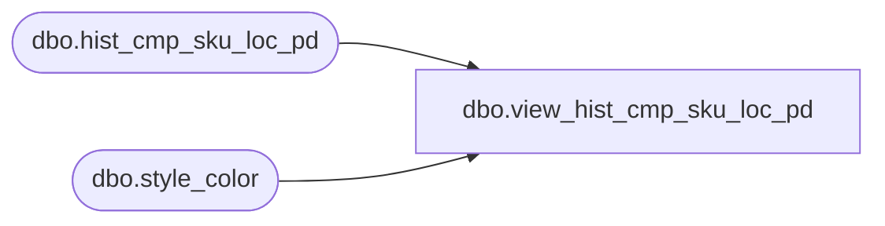

# dbo.view_hist_cmp_sku_loc_pd

**Database:** ma_01  
**Server:** bedrockdb02  

## Architecture Diagram



## Table Dependencies

| Referenced Table |
|---|
| dbo.hist_cmp_sku_loc_pd |
| dbo.style_color |

## View Code

```sql
create view dbo.view_hist_cmp_sku_loc_pd 
AS
SELECT b.style_color_id, a.style_id, a.color_id, a.size_master_id, a.merch_year_pd, a.location_id, a.component_type_code, a.history_component_id, a.component_units FROM hist_cmp_sku_loc_pd a, style_color b 
where a.style_id = b.style_id   and a.color_id = b.color_id
```

