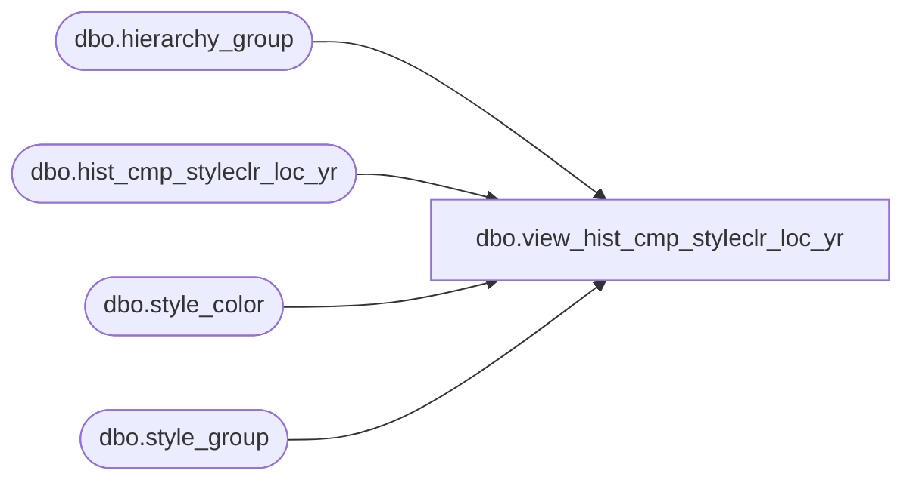

# dbo.view_hist_cmp_styleclr_loc_yr

**Database:** ma_01  
**Server:** bedrockdb02  

## Architecture Diagram



## Table Dependencies

| Referenced Table |
|---|
| dbo.hierarchy_group |
| dbo.hist_cmp_styleclr_loc_yr |
| dbo.style_color |
| dbo.style_group |

## View Code

```sql
create view dbo.view_hist_cmp_styleclr_loc_yr 

AS
SELECT b.style_color_id, a.style_id, a.color_id, a.merch_year, a.location_id, a.component_type_code, a.history_component_id, a.component_units, 
a.component_retail, a.component_cost, a.component_sellcurr_retail, a.component_retail_te, a.component_sellcurr_retail_te, a.component_cost_local,
c.hierarchy_group_id
FROM hist_cmp_styleclr_loc_yr a, style_color b, hierarchy_group c, style_group d
WHERE a.style_id = b.style_id   and a.color_id = b.color_id
and
b.style_id = d.style_id
and d.hierarchy_group_id = c.hierarchy_group_id
and d.main_group_flag = 1
and c.hierarchy_id =1
```

