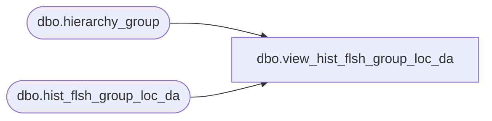

# dbo.view_hist_flsh_group_loc_da

**Database:** ma_01  
**Server:** bedrockdb02  

## Architecture Diagram



## Table Dependencies

| Referenced Table |
|---|
| dbo.hierarchy_group |
| dbo.hist_flsh_group_loc_da |

## View Code

```sql
create view dbo.view_hist_flsh_group_loc_da 


as
select	location_id, 
	sales_date, 
	sum(sales_net_units)sales_net_units, 
	sum(sales_net_retail)sales_net_retail,
	sum(sales_net_retail_te)sales_net_retail_te,
	sum(sales_net_cost)sales_net_cost,
	sum(sales_net_sellcurr_retail)sales_net_sellcurr_retail, 
	sum(sales_net_sellcurr_retail_te)sales_net_sellcurr_retail_te,
	sum(sales_net_cost_local) sales_net_cost_local
from	hist_flsh_group_loc_da h, 
	hierarchy_group hg
where	h.hierarchy_group_id = hg.hierarchy_group_id and
	hg.hierarchy_id =1
group by location_id, sales_date
```

