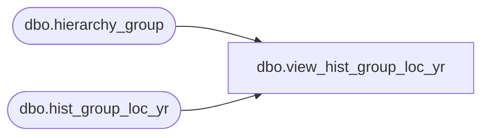

# dbo.view_hist_group_loc_yr

**Database:** ma_01  
**Server:** bedrockdb02  

## Architecture Diagram



## Table Dependencies

| Referenced Table |
|---|
| dbo.hierarchy_group |
| dbo.hist_group_loc_yr |

## View Code

```sql
CREATE VIEW dbo.view_hist_group_loc_yr

AS

SELECT
	 h.merch_year
	,h.location_id
	,SUM (h.perm_md_retail) AS perm_md_retail
	,SUM (h.perm_mu_retail) AS perm_mu_retail
	,SUM (h.perm_mdc_retail) AS perm_mdc_retail
	,SUM (h.perm_muc_retail) AS perm_muc_retail
	,SUM (h.promo_pc_total_retail) AS promo_pc_total_retail
	,SUM (h.received_units) AS received_units
	,SUM (h.received_retail) AS received_retail
	,SUM (h.received_cost) AS received_cost
	,SUM (h.return_to_vendor_units) AS return_to_vendor_units
	,SUM (h.return_to_vendor_retail) AS return_to_vendor_retail
	,SUM (h.return_to_vendor_cost) AS return_to_vendor_cost
	,SUM (h.distributions_units) AS distributions_units
	,SUM (h.distributions_retail) AS distributions_retail
	,SUM (h.distributions_cost) AS distributions_cost
	,SUM (h.transfer_in_units) AS transfer_in_units
	,SUM (h.transfer_in_retail) AS transfer_in_retail
	,SUM (h.transfer_in_cost) AS transfer_in_cost
	,SUM (h.transfer_out_units) AS transfer_out_units
	,SUM (h.transfer_out_retail) AS transfer_out_retail
	,SUM (h.transfer_out_cost) AS transfer_out_cost
	,SUM (h.sales_total_units) AS sales_total_units
	,SUM (h.sales_total_retail) AS sales_total_retail
	,SUM (h.sales_total_cost) AS sales_total_cost
	,SUM (h.return_units) AS return_units
	,SUM (h.return_retail) AS return_retail
	,SUM (h.return_cost) AS return_cost
	,SUM (h.shrink_actual_units) AS shrink_actual_units
	,SUM (h.shrink_actual_retail) AS shrink_actual_retail
	,SUM (h.shrink_actual_cost) AS shrink_actual_cost
	,SUM (h.shrink_provision_units) AS shrink_provision_units
	,SUM (h.shrink_provision_retail) AS shrink_provision_retail
	,SUM (h.shrink_provision_cost) AS shrink_provision_cost
	,SUM (h.adjustments_total_units) AS adjustments_total_units
	,SUM (h.adjustments_total_retail) AS adjustments_total_retail
	,SUM (h.adjustments_total_cost) AS adjustments_total_cost
	,SUM (h.cost_factors_total_cost) AS cost_factors_total_cost
	,SUM (h.discounts_total_cost) AS discounts_total_cost
	,SUM (h.sales_total_sellcurr_retail) AS sales_total_sellcurr_retail
	,SUM (h.return_sellcurr_retail) AS return_sellcurr_retail
	,SUM (h.perm_md_sellcurr_retail) AS perm_md_sellcurr_retail
	,SUM (h.perm_mu_sellcurr_retail) AS perm_mu_sellcurr_retail
	,SUM (h.perm_mdc_sellcurr_retail) AS perm_mdc_sellcurr_retail
	,SUM (h.perm_muc_sellcurr_retail) AS perm_muc_sellcurr_retail
	,SUM (h.promo_pc_total_sellcurr_retail) AS promo_pc_total_sellcurr_retail
	,SUM (h.exchange_rate_diff_retail) AS exchange_rate_diff_retail
	,SUM (h.adjustments_total_retail_te) AS adjustments_total_retail_te
	,SUM (h.distributions_retail_te) AS distributions_retail_te
	,SUM (h.perm_md_retail_te) AS perm_md_retail_te
	,SUM (h.perm_md_sellcurr_retail_te) AS perm_md_sellcurr_retail_te
	,SUM (h.perm_mdc_retail_te) AS perm_mdc_retail_te
	,SUM (h.perm_mdc_sellcurr_retail_te) AS perm_mdc_sellcurr_retail_te
	,SUM (h.perm_mu_retail_te) AS perm_mu_retail_te
	,SUM (h.perm_mu_sellcurr_retail_te) AS perm_mu_sellcurr_retail_te
	,SUM (h.perm_muc_retail_te) AS perm_muc_retail_te
	,SUM (h.perm_muc_sellcurr_retail_te) AS perm_muc_sellcurr_retail_te
	,SUM (h.promo_pc_total_retail_te) AS promo_pc_total_retail_te
	,SUM (h.promo_pc_total_sellcurr_ret_te) AS promo_pc_total_sellcurr_ret_te
	,SUM (h.received_retail_te) AS received_retail_te
	,SUM (h.return_retail_te) AS return_retail_te
	,SUM (h.return_sellcurr_retail_te) AS return_sellcurr_retail_te
	,SUM (h.return_to_vendor_retail_te) AS return_to_vendor_retail_te
	,SUM (h.sales_total_retail_te) AS sales_total_retail_te
	,SUM (h.sales_total_sellcurr_retail_te) AS sales_total_sellcurr_retail_te
	,SUM (h.shrink_actual_retail_te) AS shrink_actual_retail_te
	,SUM (h.transfer_in_retail_te) AS transfer_in_retail_te
	,SUM (h.transfer_out_retail_te) AS transfer_out_retail_te
	,SUM (h.inventory_reductions_cost) AS inventory_reductions_cost
	,SUM (h.shrink_total_cost) AS shrink_total_cost
	,SUM (h.markdown_cost) AS markdown_cost
	,SUM (h.markdown_promo_cost) AS markdown_promo_cost
	,SUM (h.rim_additions_cost) AS rim_additions_cost
	,SUM (h.distribution_net_retail) AS distribution_net_retail
	,SUM (h.purchase_net_retail) AS purchase_net_retail
	,SUM (h.transfer_net_retail) AS transfer_net_retail
	,SUM (h.markups_retail) AS markups_retail
	,SUM (h.received_retail_local) AS received_retail_local
	,SUM (h.received_retail_te_local) AS received_retail_te_local
	,SUM (h.received_cost_local) AS received_cost_local
	,SUM (h.return_to_vendor_retail_local) AS return_to_vendor_retail_local
	,SUM (h.return_to_vendor_retail_te_local) AS return_to_vendor_retail_te_local
	,SUM (h.return_to_vendor_cost_local) AS return_to_vendor_cost_local
	,SUM (h.distributions_retail_local) AS distributions_retail_local
	,SUM (h.distributions_retail_te_local) AS distributions_retail_te_local
	,SUM (h.distributions_cost_local) AS distributions_cost_local
	,SUM (h.transfer_in_retail_local) AS transfer_in_retail_local
	,SUM (h.transfer_in_retail_te_local) AS transfer_in_retail_te_local
	,SUM (h.transfer_in_cost_local) AS transfer_in_cost_local
	,SUM (h.transfer_out_retail_local) AS transfer_out_retail_local
	,SUM (h.transfer_out_retail_te_local) AS transfer_out_retail_te_local
	,SUM (h.transfer_out_cost_local) AS transfer_out_cost_local
	,SUM (h.sales_total_cost_local) AS sales_total_cost_local
	,SUM (h.return_cost_local) AS return_cost_local
	,SUM (h.shrink_actual_retail_local) AS shrink_actual_retail_local
	,SUM (h.shrink_actual_retail_te_local) AS shrink_actual_retail_te_local
	,SUM (h.shrink_actual_cost_local) AS shrink_actual_cost_local
	,SUM (h.shrink_provision_retail_local) AS shrink_provision_retail_local
	,SUM (h.shrink_provision_cost_local) AS shrink_provision_cost_local
	,SUM (h.adjustments_total_retail_local) AS adjustments_total_retail_local
	,SUM (h.adjustments_total_retail_te_local) AS adjustments_total_retail_te_local
	,SUM (h.adjustments_total_cost_local) AS adjustments_total_cost_local
	,SUM (h.cost_factors_total_cost_local) AS cost_factors_total_cost_local
	,SUM (h.discounts_total_cost_local) AS discounts_total_cost_local
	,SUM (h.inventory_reductions_cost_local) AS inventory_reductions_cost_local
	,SUM (h.shrink_total_cost_local) AS shrink_total_cost_local
	,SUM (h.markdown_cost_local) AS markdown_cost_local
	,SUM (h.markdown_promo_cost_local) AS markdown_promo_cost_local
	,SUM (h.rim_additions_cost_local) AS rim_additions_cost_local
	,SUM (h.distribution_net_retail_local) AS distribution_net_retail_local
	,SUM (h.purchase_net_retail_local) AS purchase_net_retail_local
	,SUM (h.transfer_net_retail_local) AS transfer_net_retail_local
	,SUM (h.markups_retail_local) AS markups_retail_local
	,SUM (h.shipped_units) AS shipped_units
	,SUM (h.shipped_cost) AS shipped_cost
	,SUM (h.shipped_cost_local) AS shipped_cost_local
	,SUM (h.shipped_retail) AS shipped_retail
	,SUM (h.shipped_retail_te) AS shipped_retail_te
	,SUM (h.shipped_retail_local) AS shipped_retail_local
	,SUM (h.shipped_retail_te_local) AS shipped_retail_te_local
FROM
	dbo.hist_group_loc_yr h
	INNER JOIN dbo.hierarchy_group hg ON hg.hierarchy_group_id = h.hierarchy_group_id
		AND hg.hierarchy_id = 1
GROUP BY
	 h.merch_year
	,h.location_id
```

