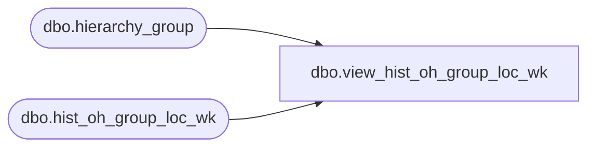

# dbo.view_hist_oh_group_loc_wk

**Database:** ma_01  
**Server:** bedrockdb02  

## Architecture Diagram



## Table Dependencies

| Referenced Table |
|---|
| dbo.hierarchy_group |
| dbo.hist_oh_group_loc_wk |

## View Code

```sql
create view dbo.view_hist_oh_group_loc_wk 
as
select  merch_year_wk, location_id, inventory_status_id,
 price_status_id, 
 sum(on_hand_units) on_hand_units, 
 sum(on_hand_retail) on_hand_retail, 
 sum(on_hand_retail_te) on_hand_retail_te, 
 sum(on_hand_cost) on_hand_cost,
 sum(on_hand_retail_local) on_hand_retail_local,
 sum(on_hand_retail_te_local) on_hand_retail_te_local,
 sum(on_hand_cost_local) on_hand_cost_local
 from hist_oh_group_loc_wk h , hierarchy_group hg
 where h.hierarchy_group_id = hg.hierarchy_group_id and
 hg.hierarchy_id =1
 group by merch_year_wk, location_id, inventory_status_id, price_status_id
```

