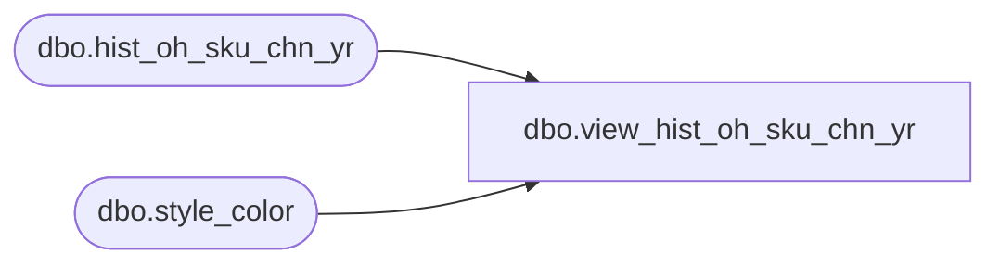

# dbo.view_hist_oh_sku_chn_yr

**Database:** ma_01  
**Server:** bedrockdb02  

## Architecture Diagram



## Table Dependencies

| Referenced Table |
|---|
| dbo.hist_oh_sku_chn_yr |
| dbo.style_color |

## View Code

```sql
create view dbo.view_hist_oh_sku_chn_yr 
AS
SELECT b.style_color_id, a.style_id, a.color_id, a.size_master_id, a.merch_year, a.inventory_status_id, a.price_status_id, a.on_hand_units FROM hist_oh_sku_chn_yr a, style_color b 
where a.style_id = b.style_id   and a.color_id = b.color_id
```

