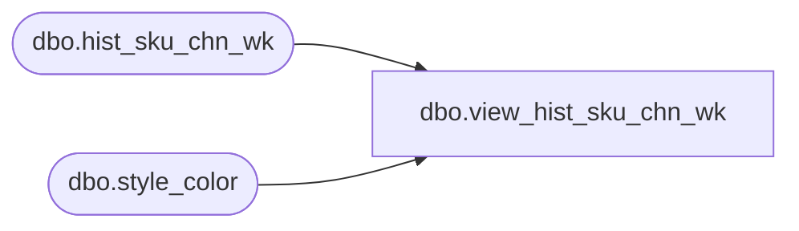

# dbo.view_hist_sku_chn_wk

**Database:** ma_01  
**Server:** bedrockdb02  

## Architecture Diagram



## Table Dependencies

| Referenced Table |
|---|
| dbo.hist_sku_chn_wk |
| dbo.style_color |

## View Code

```sql
CREATE VIEW dbo.view_hist_sku_chn_wk

AS

SELECT
	 sc.style_color_id
	,h.style_id
	,h.color_id
	,h.size_master_id
	,h.merch_year_wk
	,h.received_units
	,h.return_to_vendor_units
	,h.distributions_units
	,h.transfer_in_units
	,h.transfer_out_units
	,h.sales_total_units
	,h.return_units
	,h.shrink_actual_units
	,h.adjustments_total_units
	,h.shipped_units
FROM
	dbo.hist_sku_chn_wk h
	INNER JOIN dbo.style_color sc ON sc.style_id = h.style_id
		AND sc.color_id = h.color_id
```

