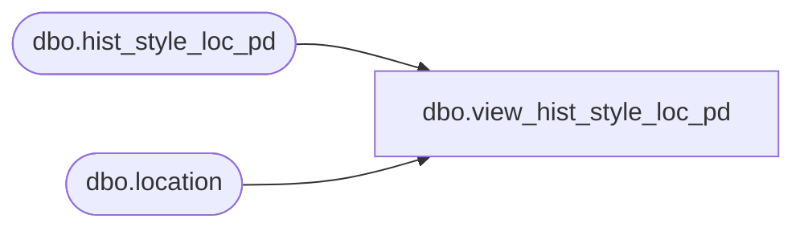

# dbo.view_hist_style_loc_pd

**Database:** ma_01  
**Server:** bedrockdb02  

## Architecture Diagram



## Table Dependencies

| Referenced Table |
|---|
| dbo.hist_style_loc_pd |
| dbo.location |

## View Code

```sql
CREATE VIEW [dbo].[view_hist_style_loc_pd]

AS
SELECT 
style_id, merch_year_pd, l.location_id,	
perm_md_retail,	perm_mu_retail,	perm_mdc_retail,	
perm_muc_retail, promo_pc_total_retail,	received_units,	
received_retail, received_cost,	return_to_vendor_units,	
return_to_vendor_retail, return_to_vendor_cost, 
distributions_units, distributions_retail, 
distributions_cost,	transfer_in_units, 
transfer_in_retail, transfer_in_cost, transfer_out_units, 
transfer_out_retail, transfer_out_cost, 
sales_total_units,	sales_total_retail, 
sales_total_cost, return_units, return_retail,	return_cost, shrink_actual_units,	
shrink_actual_retail, shrink_actual_cost, 
adjustments_total_units, adjustments_total_retail, adjustments_total_cost,	
cost_factors_total_cost, discounts_total_cost, 
sales_total_sellcurr_retail, return_sellcurr_retail, perm_md_sellcurr_retail,	
perm_mu_sellcurr_retail, perm_mdc_sellcurr_retail, 
perm_muc_sellcurr_retail, promo_pc_total_sellcurr_retail,	exchange_rate_diff_retail,	
perm_md_retail_te, perm_mu_retail_te,	perm_mdc_retail_te, 
perm_muc_retail_te,	promo_pc_total_retail_te, received_retail_te,	
return_to_vendor_retail_te, distributions_retail_te,	
transfer_in_retail_te, transfer_out_retail_te, 
sales_total_retail_te,	return_retail_te, 
shrink_actual_retail_te, adjustments_total_retail_te, sales_total_sellcurr_retail_te,	return_sellcurr_retail_te,	
perm_md_sellcurr_retail_te, perm_mu_sellcurr_retail_te,	
perm_mdc_sellcurr_retail_te, perm_muc_sellcurr_retail_te, 
promo_pc_total_sellcurr_ret_te, received_retail_local, received_retail_te_local, received_cost_local, 
return_to_vendor_retail_local, return_to_vendor_retail_te_local, 
return_to_vendor_cost_local, distributions_retail_local, distributions_retail_te_local, 
distributions_cost_local, transfer_in_retail_local, 
transfer_in_retail_te_local, transfer_in_cost_local,	
transfer_out_retail_local, transfer_out_retail_te_local, 
transfer_out_cost_local, sales_total_cost_local,	
return_cost_local, shrink_actual_retail_local,	
shrink_actual_retail_te_local, shrink_actual_cost_local, 
adjustments_total_retail_local,	adjustments_total_retail_te_local, 
adjustments_total_cost_local, cost_factors_total_cost_local, discounts_total_cost_local, 
shipped_units, shipped_cost, shipped_cost_local, 
shipped_retail, shipped_retail_te, shipped_retail_local,	
shipped_retail_te_local, l.jurisdiction_id
FROM hist_style_loc_pd
INNER JOIN location l ON l.location_id = hist_style_loc_pd.location_id
```

