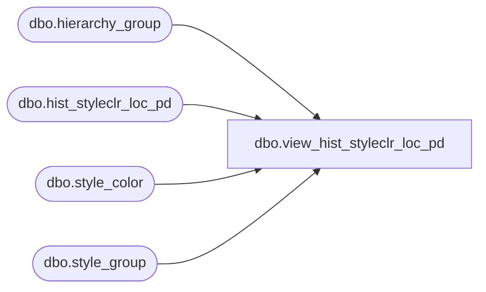

# dbo.view_hist_styleclr_loc_pd

**Database:** ma_01  
**Server:** bedrockdb02  

## Architecture Diagram



## Table Dependencies

| Referenced Table |
|---|
| dbo.hierarchy_group |
| dbo.hist_styleclr_loc_pd |
| dbo.style_color |
| dbo.style_group |

## View Code

```sql
CREATE VIEW dbo.view_hist_styleclr_loc_pd

AS

SELECT
	 sc.style_color_id
	,h.style_id
	,h.color_id
	,h.merch_year_pd
	,h.location_id
	,h.perm_md_retail
	,h.perm_mu_retail
	,h.perm_mdc_retail
	,h.perm_muc_retail
	,h.promo_pc_total_retail
	,h.received_units
	,h.received_retail
	,h.return_to_vendor_units
	,h.return_to_vendor_retail
	,h.distributions_units
	,h.distributions_retail
	,h.transfer_in_units
	,h.transfer_in_retail
	,h.transfer_out_units
	,h.transfer_out_retail
	,h.sales_total_units
	,h.sales_total_retail
	,h.sales_total_cost
	,h.return_units
	,h.return_retail
	,h.return_cost
	,h.shrink_actual_units
	,h.shrink_actual_retail
	,h.adjustments_total_units
	,h.adjustments_total_retail
	,hg.hierarchy_group_id
	,h.adjustments_total_retail_te
	,h.distributions_retail_te
	,h.perm_md_retail_te
	,h.perm_mdc_retail_te
	,h.perm_mu_retail_te
	,h.perm_muc_retail_te
	,h.promo_pc_total_retail_te
	,h.received_retail_te
	,h.return_retail_te
	,h.return_to_vendor_retail_te
	,h.sales_total_retail_te
	,h.shrink_actual_retail_te
	,h.transfer_in_retail_te
	,h.transfer_out_retail_te
	,h.received_retail_local
	,h.received_retail_te_local
	,h.return_to_vendor_retail_local
	,h.return_to_vendor_retail_te_local
	,h.distributions_retail_local
	,h.distributions_retail_te_local
	,h.transfer_in_retail_local
	,h.transfer_in_retail_te_local
	,h.transfer_out_retail_local
	,h.transfer_out_retail_te_local
	,h.sales_total_cost_local
	,h.return_cost_local
	,h.shrink_actual_retail_local
	,h.shrink_actual_retail_te_local
	,h.adjustments_total_retail_local
	,h.adjustments_total_retail_te_local
	,h.shipped_units
	,h.shipped_retail
	,h.shipped_retail_te
	,h.shipped_retail_local
	,h.shipped_retail_te_local
FROM
	dbo.hist_styleclr_loc_pd h
	INNER JOIN dbo.style_color sc ON sc.style_id = h.style_id
		AND sc.color_id = h.color_id
	INNER JOIN dbo.style_group sg ON sg.style_id = sc.style_id
		AND sg.main_group_flag = 1
	INNER JOIN dbo.hierarchy_group hg ON hg.hierarchy_group_id = sg.hierarchy_group_id
		AND hg.hierarchy_id = 1
```

