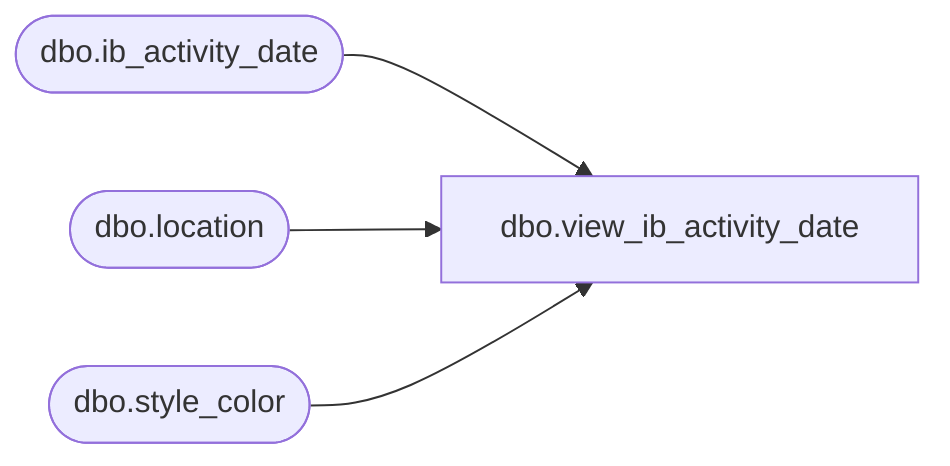

# dbo.view_ib_activity_date

**Database:** ma_01  
**Server:** bedrockdb02  

## Architecture Diagram



## Table Dependencies

| Referenced Table |
|---|
| dbo.ib_activity_date |
| dbo.location |
| dbo.style_color |

## View Code

```sql
create view dbo.view_ib_activity_date 

as
select
	sc.style_color_id,
	i.ib_activity_date_id,
	i.style_id,
	i.color_id,
	i.location_id,
	i.first_receipt_date,
	i.last_receipt_date,
	i.first_sale_date,
	i.last_sale_date,
	i.first_on_order_date,
	i.last_on_order_date,
	i.first_po_receipt_date,
	i.last_po_receipt_date,
	i.first_markdown_date,
	i.last_markdown_date,
        l.jurisdiction_id
from
	ib_activity_date i
	INNER JOIN style_color sc ON i.style_id = sc.style_id AND i.color_id = sc.color_id
	LEFT OUTER JOIN location l ON i.location_id =l.location_id
```

