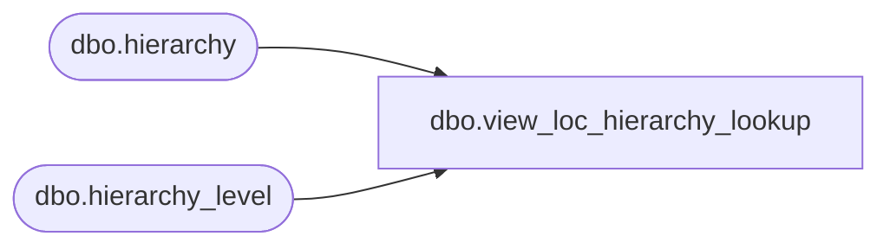

# dbo.view_loc_hierarchy_lookup

**Database:** ma_01  
**Server:** bedrockdb02  

## Architecture Diagram



## Table Dependencies

| Referenced Table |
|---|
| dbo.hierarchy |
| dbo.hierarchy_level |

## View Code

```sql
create view [dbo].[view_loc_hierarchy_lookup] AS
select hl.hierarchy_level_id,
 h.hierarchy_label+ N'-' + hl.hierarchy_level_label hierarchy_level_label,
 hl.hierarchy_id,hl.parent_level_id,h.hierarchy_type
 from hierarchy_level hl , hierarchy h
where hl.hierarchy_id =h.hierarchy_id
and h.hierarchy_type =2 and hl.parent_level_id is NOT NULL
```

