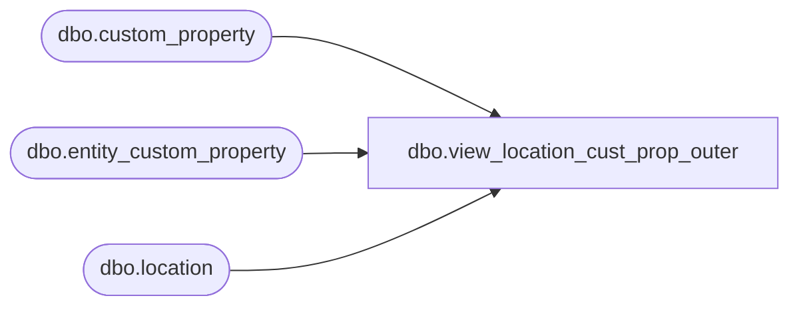

# dbo.view_location_cust_prop_outer

**Database:** ma_01  
**Server:** bedrockdb02  

## Architecture Diagram



## Table Dependencies

| Referenced Table |
|---|
| dbo.custom_property |
| dbo.entity_custom_property |
| dbo.location |

## View Code

```sql
create view dbo.view_location_cust_prop_outer AS
SELECT g.location_id,f.custom_property_value,
{fn IFNULL(g.custom_property_id ,-1)} custom_property_id
FROM  (  SELECT DISTINCT a.location_id,  
                         e.custom_property_value,
                         e.custom_property_id
         FROM entity_custom_property  e RIGHT JOIN location a 
         ON a.location_id =e.parent_id and e.parent_type =2
         LEFT JOIN  custom_property b
         ON e.custom_property_id = b.custom_property_id ) f
         RIGHT JOIN  
      (  SELECT DISTINCT a.location_id, 
                         NULL custom_property_value,
                         e.custom_property_id
         FROM custom_property e ,location a
         WHERE e.entity_type=2) g
ON f.location_id = g.location_id
AND  (f.custom_property_id = g.custom_property_id 
OR    f.custom_property_id is NULL)
```

