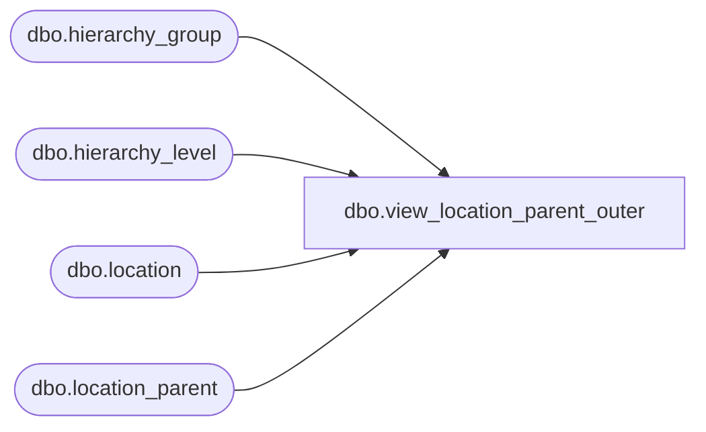

# dbo.view_location_parent_outer

**Database:** ma_01  
**Server:** bedrockdb02  

## Architecture Diagram



## Table Dependencies

| Referenced Table |
|---|
| dbo.hierarchy_group |
| dbo.hierarchy_level |
| dbo.location |
| dbo.location_parent |

## View Code

```sql
create view dbo.view_location_parent_outer 


AS
SELECT g.location_id,f.hierarchy_group_id, f.hierarchy_group_code, f.hierarchy_group_label, f.hierarchy_group_short_label,g.hierarchy_level_id, f.hierarchy_level_label
FROM     
  (  SELECT DISTINCT a.location_id,  
                     b.hierarchy_group_id,  
                     b.hierarchy_group_code,
                     b.hierarchy_group_label,
                     b.hierarchy_group_short_label, 
                     e.hierarchy_level_id,
                     c.hierarchy_level_label                   
     FROM location_parent e RIGHT JOIN location a 
         on a.location_id =e.location_id 
     LEFT JOIN  hierarchy_group b
         on e.parent_hierarchy_group_id = b.hierarchy_group_id 
     LEFT JOIN hierarchy_level c
         on e.hierarchy_level_id = c.hierarchy_level_id) f 
RIGHT JOIN 
  (  SELECT DISTINCT  
                 a.location_id, 
                 NULL hierarchy_group_id,
                 e.hierarchy_level_id
     FROM location_parent e ,location a ) g
on f.location_id = g.location_id
AND  (f.hierarchy_level_id = g.hierarchy_level_id
OR    f.hierarchy_level_id is NULL)
```

