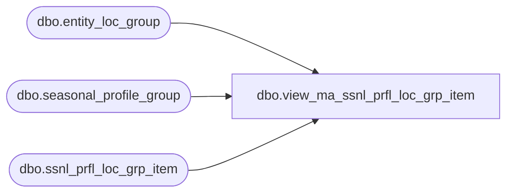

# dbo.view_ma_ssnl_prfl_loc_grp_item

**Database:** ma_01  
**Server:** bedrockdb02  

## Architecture Diagram



## Table Dependencies

| Referenced Table |
|---|
| dbo.entity_loc_group |
| dbo.seasonal_profile_group |
| dbo.ssnl_prfl_loc_grp_item |

## View Code

```sql
CREATE VIEW dbo.view_ma_ssnl_prfl_loc_grp_item  
AS
select s.seasonal_profile_group_id, s.name seasonal_prfl_grp_name, e.entity_loc_group_id, e.entity_loc_group_name
from seasonal_profile_group s, entity_loc_group e, ssnl_prfl_loc_grp_item ss
where s.seasonal_profile_group_id = ss.seasonal_profile_group_id
and e.entity_loc_group_id = ss.entity_loc_group_id
```

