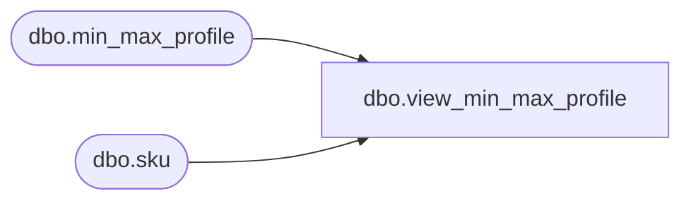

# dbo.view_min_max_profile

**Database:** ma_01  
**Server:** bedrockdb02  

## Architecture Diagram



## Table Dependencies

| Referenced Table |
|---|
| dbo.min_max_profile |
| dbo.sku |

## View Code

```sql
create view [dbo].[view_min_max_profile] AS
SELECT
	k.sku_id, k.style_id, k.color_id, k.size_master_id
	, location_id
	, dynamic_start_date, last_activity_date, source
    , presentation_stock, capacity_maximum
    , minimum, maximum
    , dynamic_minimum, dynamic_maximum
	, CASE 
		WHEN order_point = 1 THEN minimum + (CASE WHEN incl_pres_stock_with_ord_pt_fl = 1 THEN presentation_stock ELSE 0 END)
		WHEN order_point = 2 THEN maximum + (CASE WHEN incl_pres_stock_with_ord_pt_fl = 1 THEN presentation_stock ELSE 0 END)
	  END order_point
FROM   
	min_max_profile m
INNER JOIN sku k ON m.sku_id = k.sku_id
```

