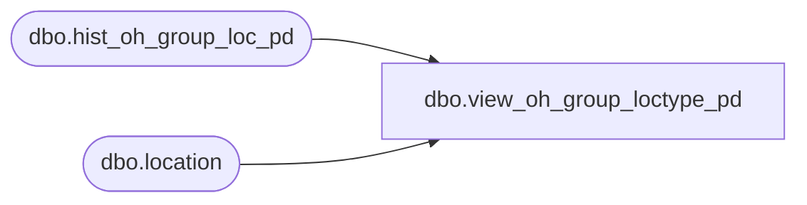

# dbo.view_oh_group_loctype_pd

**Database:** ma_01  
**Server:** bedrockdb02  

## Architecture Diagram



## Table Dependencies

| Referenced Table |
|---|
| dbo.hist_oh_group_loc_pd |
| dbo.location |

## View Code

```sql
create view dbo.view_oh_group_loctype_pd 
as
select  h.hierarchy_group_id,  h.merch_year_pd, h.inventory_status_id,
h.price_status_id ,h.location_id, l.location_type, 
sum (h.on_hand_units) on_hand_units,
sum (h.on_hand_retail) on_hand_retail, 
sum (h.on_hand_retail_te) on_hand_retail_te, 
sum (h.on_hand_cost) on_hand_cost,
sum (h.on_hand_retail_local) on_hand_retail_local,
sum (h.on_hand_retail_te_local) on_hand_retail_te_local,
sum (h.on_hand_cost_local) on_hand_cost_local
from hist_oh_group_loc_pd h, location l
where h.location_id = l.location_id
group by h.hierarchy_group_id, h.merch_year_pd, h.inventory_status_id,
h.price_status_id , h.location_id, l.location_type
```

