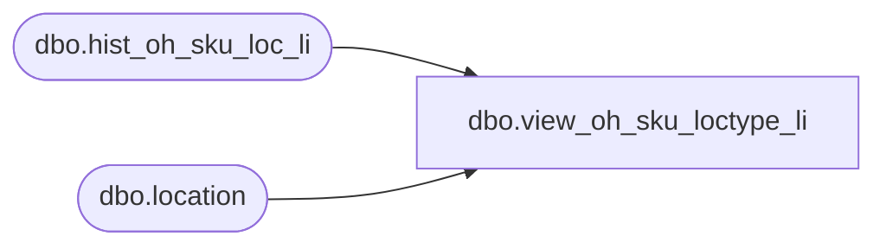

# dbo.view_oh_sku_loctype_li

**Database:** ma_01  
**Server:** bedrockdb02  

## Architecture Diagram



## Table Dependencies

| Referenced Table |
|---|
| dbo.hist_oh_sku_loc_li |
| dbo.location |

## View Code

```sql
create view dbo.view_oh_sku_loctype_li as
select h.style_id, h.color_id, h.size_master_id,
h.inventory_status_id, h.price_status_id ,h.location_id, l.location_type, 
sum (h.on_hand_units) on_hand_units
from hist_oh_sku_loc_li h, location l
where h.location_id = l.location_id
group by h.style_id, h.color_id, h.size_master_id, h.inventory_status_id,
h.price_status_id , h.location_id, l.location_type
```

