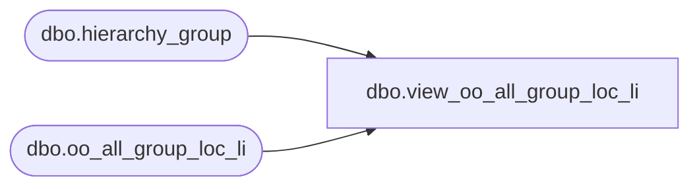

# dbo.view_oo_all_group_loc_li

**Database:** ma_01  
**Server:** bedrockdb02  

## Architecture Diagram



## Table Dependencies

| Referenced Table |
|---|
| dbo.hierarchy_group |
| dbo.oo_all_group_loc_li |

## View Code

```sql
create view dbo.view_oo_all_group_loc_li


as
   select  location_id, 
   sum(on_order_units) on_order_units, 
   sum(on_order_retail) on_order_retail, 
   sum(on_order_cost) on_order_cost,
   sum(allocation_units) allocation_units,
   sum(on_order_retail_local) on_order_retail_local,
   sum(on_order_retail_te_local) on_order_retail_te_local,
   sum(on_order_cost_local) on_order_cost_local
   from oo_all_group_loc_li h , hierarchy_group hg
   where h.hierarchy_group_id = hg.hierarchy_group_id and
   hg.hierarchy_id =1
   group by location_id
```

