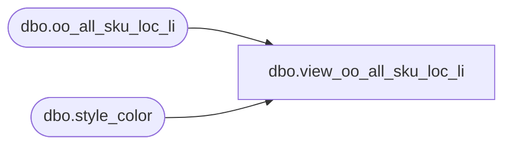

# dbo.view_oo_all_sku_loc_li

**Database:** ma_01  
**Server:** bedrockdb02  

## Architecture Diagram



## Table Dependencies

| Referenced Table |
|---|
| dbo.oo_all_sku_loc_li |
| dbo.style_color |

## View Code

```sql
create view dbo.view_oo_all_sku_loc_li 
AS
SELECT b.style_color_id, a.style_id, a.color_id, a.size_master_id, a.location_id, a.on_order_units, a.allocation_units FROM oo_all_sku_loc_li a, style_color b 
where a.style_id = b.style_id   and a.color_id = b.color_id
```

