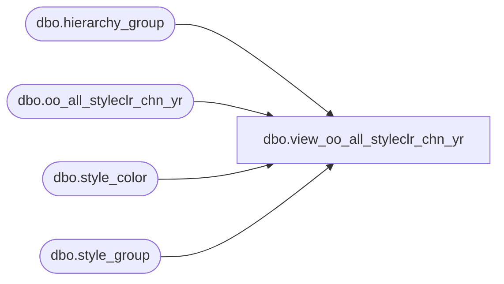

# dbo.view_oo_all_styleclr_chn_yr

**Database:** ma_01  
**Server:** bedrockdb02  

## Architecture Diagram



## Table Dependencies

| Referenced Table |
|---|
| dbo.hierarchy_group |
| dbo.oo_all_styleclr_chn_yr |
| dbo.style_color |
| dbo.style_group |

## View Code

```sql
create view dbo.view_oo_all_styleclr_chn_yr 

AS
SELECT b.style_color_id, a.style_id, a.color_id, a.merch_year, a.on_order_units, a.on_order_retail, a.allocation_units,  c.hierarchy_group_id
FROM oo_all_styleclr_chn_yr a, style_color b, hierarchy_group c, style_group d
WHERE
a.style_id = b.style_id   and a.color_id = b.color_id
and
b.style_id = d.style_id
and d.hierarchy_group_id = c.hierarchy_group_id
and d.main_group_flag = 1
and c.hierarchy_id =1
```

