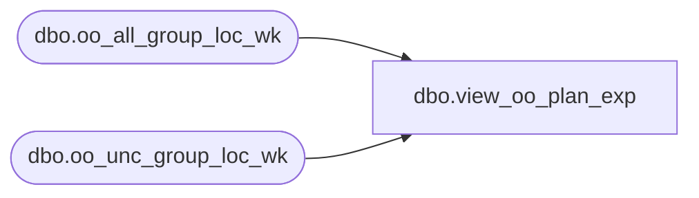

# dbo.view_oo_plan_exp

**Database:** ma_01  
**Server:** bedrockdb02  

## Architecture Diagram



## Table Dependencies

| Referenced Table |
|---|
| dbo.oo_all_group_loc_wk |
| dbo.oo_unc_group_loc_wk |

## View Code

```sql
create view dbo.view_oo_plan_exp as
select o.hierarchy_group_id, o.location_id, o.merch_year_wk, 
o.on_order_units + u.on_order_units on_order_units, 
o.on_order_retail + u.on_order_retail on_order_retail, 
o.on_order_cost + u.on_order_cost on_order_cost
from oo_all_group_loc_wk o, oo_unc_group_loc_wk u
where o.hierarchy_group_id = u.hierarchy_group_id 
and  o.location_id =  u.location_id
and  o.merch_year_wk= u.merch_year_wk
UNION all
select u.hierarchy_group_id, u.location_id, u.merch_year_wk, 
u.on_order_units , 
u.on_order_retail, 
u.on_order_cost
from  oo_unc_group_loc_wk u
where not exists (select * from oo_all_group_loc_wk o
		where o.hierarchy_group_id = u.hierarchy_group_id
		and  o.location_id =  u.location_id
		and  o.merch_year_wk= u.merch_year_wk)
UNION all
select o.hierarchy_group_id,  o.location_id, o.merch_year_wk, 
o.on_order_units,
o.on_order_retail,
o.on_order_cost 
from oo_all_group_loc_wk o
where not exists (select * from oo_unc_group_loc_wk u
		where o.hierarchy_group_id = u.hierarchy_group_id
		and  o.location_id =  u.location_id
		and  o.merch_year_wk= u.merch_year_wk)
```

