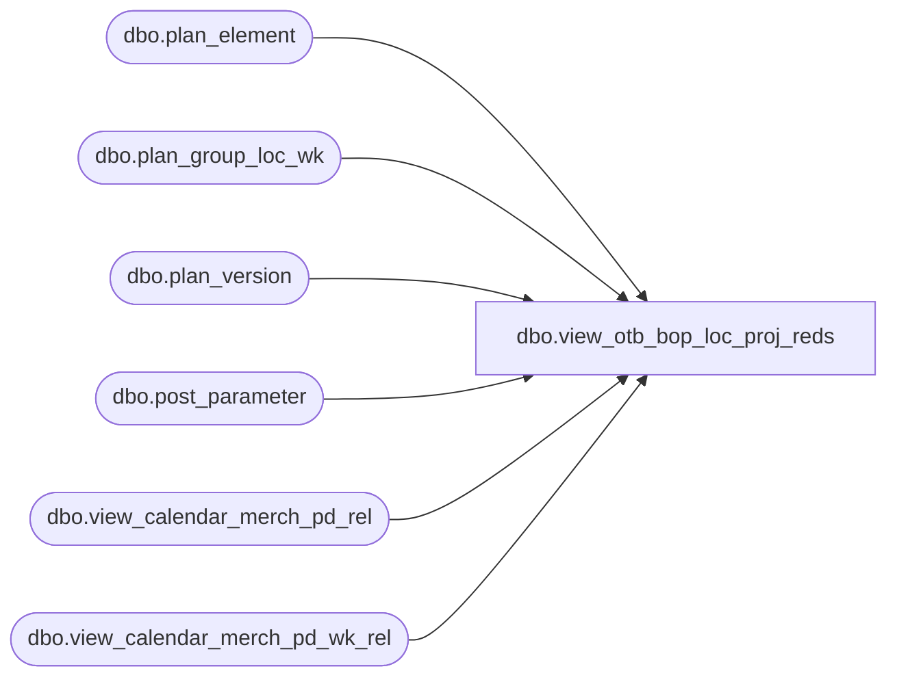

# dbo.view_otb_bop_loc_proj_reds

**Database:** ma_01  
**Server:** bedrockdb02  

## Architecture Diagram



## Table Dependencies

| Referenced Table |
|---|
| dbo.plan_element |
| dbo.plan_group_loc_wk |
| dbo.plan_version |
| dbo.post_parameter |
| dbo.view_calendar_merch_pd_rel |
| dbo.view_calendar_merch_pd_wk_rel |

## View Code

```sql
create view dbo.view_otb_bop_loc_proj_reds AS
SELECT DISTINCT a.hierarchy_group_id,g.merch_year_pd, a.location_id, 
SUM(proj_reductions_units)proj_reds_units,
SUM (proj_reductions_retail)proj_reds_retail,
SUM (proj_reductions_cost)proj_reds_cost
FROM view_calendar_merch_pd_rel f ,view_calendar_merch_pd_rel g ,
(SELECT DISTINCT a.hierarchy_group_id, w.merch_year_pd,w.relative_period,a.location_id,
SUM( (a.plan_value * p.otb_operator) * (1 - abs (sign (p.otb_element_id -4 )))) proj_reductions_units,
SUM( (a.plan_value * p.otb_operator) * (1 - abs (sign (p.otb_element_id -5)))) proj_reductions_retail,
SUM( (a.plan_value * p.otb_operator) * (1 - abs (sign (p.otb_element_id -6 )))) proj_reductions_cost
FROM  plan_group_loc_wk a,post_parameter pv, plan_element p, plan_version v ,view_calendar_merch_pd_wk_rel w
WHERE
pv.parameter_id =23
and a.plan_element_id = p.plan_element_id
and p.otb_element_id is NOT NULL
and v.plan_version_id = a.plan_version_id
and v.current_plan_flag =1
and a.merch_year_wk =w.merch_year_wk
and a.merch_year_wk >= pv.parameter_value
GROUP BY a.hierarchy_group_id, w.merch_year_pd, w.relative_period,a.location_id)a
WHERE f.merch_year_pd >= a.merch_year_pd
and f.relative_period = g.relative_period -1
GROUP BY  a.hierarchy_group_id, g.merch_year_pd,a.location_id
```

