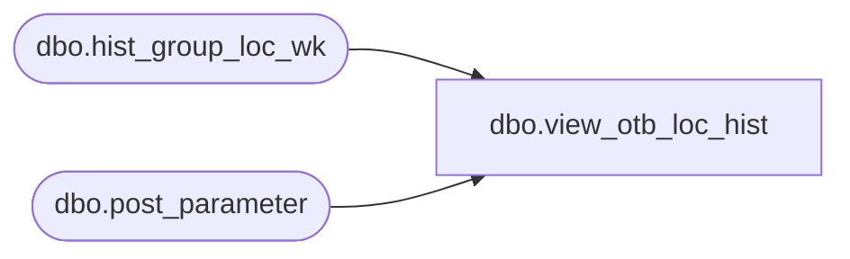

# dbo.view_otb_loc_hist

**Database:** ma_01  
**Server:** bedrockdb02  

## Architecture Diagram



## Table Dependencies

| Referenced Table |
|---|
| dbo.hist_group_loc_wk |
| dbo.post_parameter |

## View Code

```sql
create view dbo.view_otb_loc_hist


AS
select distinct c.hierarchy_group_id,c.location_id,
SUM((c.received_units- c.return_to_vendor_units)
* (1 - abs (sign (c.merch_year_wk - (p.parameter_value )))))net_rcpt_wk_to_dt_units,
SUM((c.received_retail- c.return_to_vendor_retail)
* (1 - abs (sign (c.merch_year_wk - (p.parameter_value )))))net_rcpt_wk_to_dt_retail,
SUM((c.received_retail_local- c.return_to_vendor_retail_local)
* (1 - abs (sign (c.merch_year_wk - (p.parameter_value )))))net_rcpt_wk_to_dt_retail_local,
SUM((c.received_cost- c.return_to_vendor_cost)
* (1 - abs (sign (c.merch_year_wk - (p.parameter_value )))))net_rcpt_wk_to_dt_cost,
SUM((c.received_cost_local- c.return_to_vendor_cost_local)
* (1 - abs (sign (c.merch_year_wk - (p.parameter_value )))))net_rcpt_wk_to_dt_cost_local,
SUM((c.transfer_in_units-c.transfer_out_units)  *
(1 - abs (sign (c.merch_year_wk - (p.parameter_value )))))net_trsfrs_wk_to_dt_units,
SUM((c.transfer_in_retail-c.transfer_out_retail)  *
(1 - abs (sign (c.merch_year_wk - (p.parameter_value )))))net_trsfrs_wk_to_dt_retail,
SUM((c.transfer_in_retail_local-c.transfer_out_retail_local)  *
(1 - abs (sign (c.merch_year_wk - (p.parameter_value )))))net_trsfrs_wk_to_dt_retail_local,
SUM((c.transfer_in_cost-c.transfer_out_cost)  *
(1 - abs (sign (c.merch_year_wk - (p.parameter_value )))))net_trsfrs_wk_to_dt_cost,
SUM((c.transfer_in_cost_local-c.transfer_out_cost_local)  *
(1 - abs (sign (c.merch_year_wk - (p.parameter_value )))))net_trsfrs_wk_to_dt_cost_local,
SUM(c.distributions_units  *
(1 - abs (sign (c.merch_year_wk - (p.parameter_value) )))) net_dist_wk_to_dt_units,
SUM(c.distributions_retail  *
(1 - abs (sign (c.merch_year_wk - (p.parameter_value) )))) net_dist_wk_to_dt_retail,
SUM(c.distributions_retail_local  *
(1 - abs (sign (c.merch_year_wk - (p.parameter_value) )))) net_dist_wk_to_dt_retail_local,
SUM(c.distributions_cost *
(1 - abs (sign (c.merch_year_wk - (p.parameter_value) )))) net_dist_wk_to_dt_cost,
SUM(c.distributions_cost_local *
(1 - abs (sign (c.merch_year_wk - (p.parameter_value) )))) net_dist_wk_to_dt_cost_local
from   hist_group_loc_wk c ,post_parameter p
where
 p.parameter_id =23
and p.parameter_value = c.merch_year_wk
group by c.hierarchy_group_id,c.location_id
```

