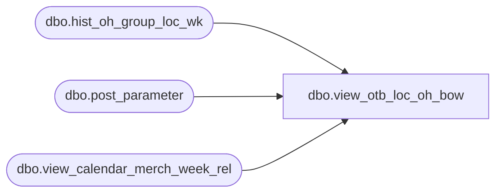

# dbo.view_otb_loc_oh_bow

**Database:** ma_01  
**Server:** bedrockdb02  

## Architecture Diagram



## Table Dependencies

| Referenced Table |
|---|
| dbo.hist_oh_group_loc_wk |
| dbo.post_parameter |
| dbo.view_calendar_merch_week_rel |

## View Code

```sql
create view dbo.view_otb_loc_oh_bow


AS
select distinct b.hierarchy_group_id, b.location_id,
SUM((b.on_hand_units)
 * (1 - abs (sign (b.merch_year_wk - (d.merch_year *100 + d.merch_week)))))oh_bow_units ,
SUM((b.on_hand_retail)
 * (1 - abs (sign (b.merch_year_wk - (d.merch_year *100 + d.merch_week)))))oh_bow_retail ,
SUM((b.on_hand_retail_local)
 * (1 - abs (sign (b.merch_year_wk - (d.merch_year *100 + d.merch_week)))))oh_bow_retail_local ,
SUM((b.on_hand_cost)
 * (1 - abs (sign (b.merch_year_wk - (d.merch_year *100 + d.merch_week)))))oh_bow_cost,
SUM((b.on_hand_cost_local)
 * (1 - abs (sign (b.merch_year_wk - (d.merch_year *100 + d.merch_week)))))oh_bow_cost_local
from  hist_oh_group_loc_wk b, post_parameter p ,view_calendar_merch_week_rel e,view_calendar_merch_week_rel d
where p.parameter_id = 23
and  p.parameter_value  = (e.merch_year * 100 + e.merch_week )
and e.relative_week = d.relative_week +1
group by  b.hierarchy_group_id, b.location_id
```

