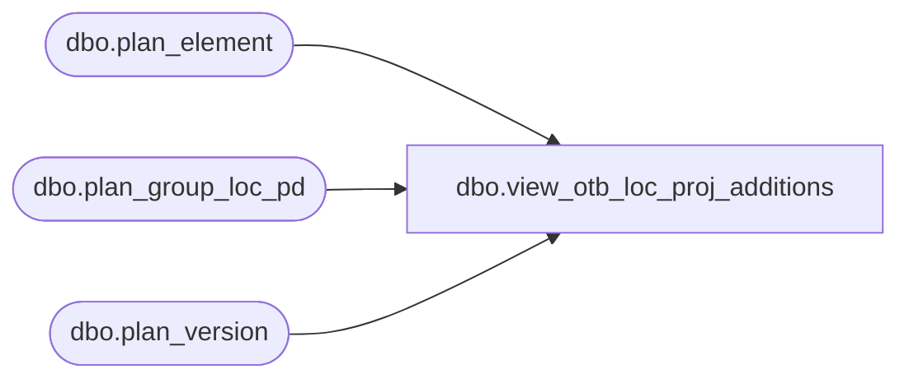

# dbo.view_otb_loc_proj_additions

**Database:** ma_01  
**Server:** bedrockdb02  

## Architecture Diagram



## Table Dependencies

| Referenced Table |
|---|
| dbo.plan_element |
| dbo.plan_group_loc_pd |
| dbo.plan_version |

## View Code

```sql
create view dbo.view_otb_loc_proj_additions

as
select distinct a.hierarchy_group_id,  a.merch_year_pd,a.location_id,
sum((a.plan_value * p.otb_operator) * (1 - abs (sign (p.otb_element_id -1 )))) proj_adds_units,
sum((a.plan_value * p.otb_operator) * (1 - abs (sign (p.otb_element_id -2 )))) proj_adds_retail,
sum((a.plan_local_value * p.otb_operator) * (1 - abs (sign (p.otb_element_id -2 )))) proj_adds_retail_local,
sum((a.plan_value * p.otb_operator) * (1 - abs (sign (p.otb_element_id -3 )))) proj_adds_cost,
sum((a.plan_local_value * p.otb_operator) * (1 - abs (sign (p.otb_element_id -3 )))) proj_adds_cost_local
from plan_group_loc_pd a, plan_element p, plan_version v
where
a.plan_element_id = p.plan_element_id
and p.otb_element_id is NOT NULL
and v.plan_version_id = a.plan_version_id
and v.current_plan_flag =1
group by a.hierarchy_group_id,  a.merch_year_pd, a.location_id
```

