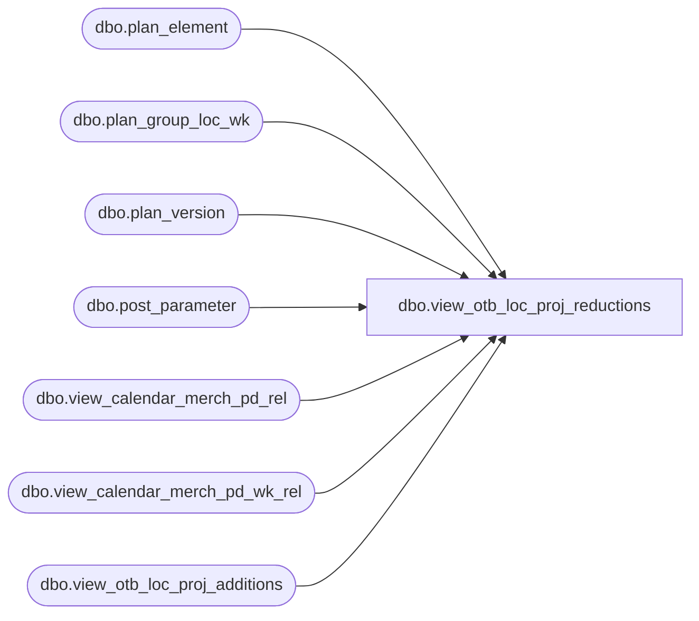

# dbo.view_otb_loc_proj_reductions

**Database:** ma_01  
**Server:** bedrockdb02  

## Architecture Diagram



## Table Dependencies

| Referenced Table |
|---|
| dbo.plan_element |
| dbo.plan_group_loc_wk |
| dbo.plan_version |
| dbo.post_parameter |
| dbo.view_calendar_merch_pd_rel |
| dbo.view_calendar_merch_pd_wk_rel |
| dbo.view_otb_loc_proj_additions |

## View Code

```sql
create view dbo.view_otb_loc_proj_reductions

as
select a.hierarchy_group_id, a.merch_year_pd,a.location_id,
SUM ((b.proj_reductions_units) *  (sign (1 + sign (b.merch_year_pd -  p.parameter_value)))
 *  (sign (1 -sign (b.merch_year_pd - g.merch_year_pd)))) proj_reds_units,
SUM ((b.proj_reductions_retail) *  (sign (1 + sign (b.merch_year_pd -  p.parameter_value)))
 *  (sign (1 -sign (b.merch_year_pd - g.merch_year_pd)))) proj_reds_retail,
SUM ((b.proj_reductions_retail_local) *  (sign (1 + sign (b.merch_year_pd -  p.parameter_value)))
 *  (sign (1 -sign (b.merch_year_pd - g.merch_year_pd)))) proj_reds_retail_local,
SUM ((b.proj_reductions_cost) *  (sign (1 + sign (b.merch_year_pd -  p.parameter_value)))
 *  (sign (1 -sign (b.merch_year_pd - g.merch_year_pd)))) proj_reds_cost,
SUM ((b.proj_reductions_cost_local) *  (sign (1 + sign (b.merch_year_pd -  p.parameter_value)))
 *  (sign (1 -sign (b.merch_year_pd - g.merch_year_pd)))) proj_reds_cost_local
from post_parameter p,view_calendar_merch_pd_rel g,view_calendar_merch_pd_rel f,
view_otb_loc_proj_additions a,
( select distinct a.hierarchy_group_id, w.merch_year_pd,w.relative_period,a.location_id,
SUM( (a.plan_value * p.otb_operator) * (1 - abs (sign (p.otb_element_id -4 )))) proj_reductions_units,
SUM( (a.plan_value * p.otb_operator) * (1 - abs (sign (p.otb_element_id -5)))) proj_reductions_retail,
SUM( (a.plan_local_value * p.otb_operator) * (1 - abs (sign (p.otb_element_id -5)))) proj_reductions_retail_local,
SUM( (a.plan_value * p.otb_operator) * (1 - abs (sign (p.otb_element_id -6 )))) proj_reductions_cost,
SUM( (a.plan_local_value * p.otb_operator) * (1 - abs (sign (p.otb_element_id -6 )))) proj_reductions_cost_local
from plan_group_loc_wk a,post_parameter pv, plan_element p, plan_version v ,view_calendar_merch_pd_wk_rel w
where
pv.parameter_id =23
and a.plan_element_id = p.plan_element_id
and p.otb_element_id is NOT NULL
and v.plan_version_id = a.plan_version_id
and v.current_plan_flag =1
and a.merch_year_wk =w.merch_year_wk
and a.merch_year_wk >= pv.parameter_value
group by a.hierarchy_group_id, w.merch_year_pd, w.relative_period,a.location_id)
 b
where  a.hierarchy_group_id =b.hierarchy_group_id
and a.location_id =b.location_id
 and p.parameter_id =11
and a.merch_year_pd = f.merch_year_pd
and f.relative_period  = g.relative_period +1
and b.merch_year_pd between p.parameter_value and g.merch_year_pd
group by
a.hierarchy_group_id,a.merch_year_pd,a.location_id
```

