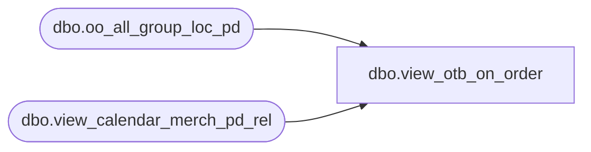

# dbo.view_otb_on_order

**Database:** ma_01  
**Server:** bedrockdb02  

## Architecture Diagram



## Table Dependencies

| Referenced Table |
|---|
| dbo.oo_all_group_loc_pd |
| dbo.view_calendar_merch_pd_rel |

## View Code

```sql
create view dbo.view_otb_on_order AS
SELECT DISTINCT  a.hierarchy_group_id,
g.merch_year_pd, 
SUM(a.on_order_units)on_order_units ,
SUM(a.on_order_retail)on_order_retail, 
SUM(a.on_order_cost)on_order_cost,
SUM(a.allocation_units)allocation_units
FROM oo_all_group_loc_pd a, view_calendar_merch_pd_rel f ,view_calendar_merch_pd_rel g
WHERE f.merch_year_pd >= a.merch_year_pd
and f.relative_period = g.relative_period -1
GROUP BY  a.hierarchy_group_id, g.merch_year_pd
```

