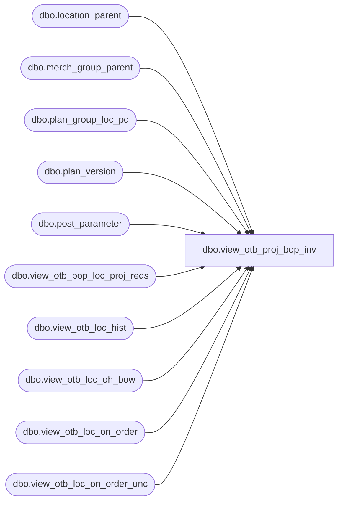

# dbo.view_otb_proj_bop_inv

**Database:** ma_01  
**Server:** bedrockdb02  

## Architecture Diagram



## Table Dependencies

| Referenced Table |
|---|
| dbo.location_parent |
| dbo.merch_group_parent |
| dbo.plan_group_loc_pd |
| dbo.plan_version |
| dbo.post_parameter |
| dbo.view_otb_bop_loc_proj_reds |
| dbo.view_otb_loc_hist |
| dbo.view_otb_loc_oh_bow |
| dbo.view_otb_loc_on_order |
| dbo.view_otb_loc_on_order_unc |

## View Code

```sql
create view dbo.view_otb_proj_bop_inv AS
SELECT DISTINCT mg.parent_hierarchy_group_id merch_group_id,
lp.parent_hierarchy_group_id location_group_id,
a.merch_year_pd, 
SUM(a.proj_bop_inv_units)proj_bop_inv_units,
SUM(a.proj_bop_inv_retail)proj_bop_inv_retail,
SUM(a.proj_bop_inv_cost)proj_bop_inv_cost
FROM (SELECT DISTINCT a.hierarchy_group_id, 
a.location_id ,
a.merch_year_pd ,
({fn IFNULL(b.oh_bow_units,0)} +
    {fn IFNULL(c.net_rcpt_wk_to_dt_units,0)} +
 {fn IFNULL(c.net_trsfrs_wk_to_dt_units,0)}+
 {fn IFNULL (c.net_dist_wk_to_dt_units,0)} +
 {fn IFNULL (d.on_order_units,0)} -
 {fn IFNULL (e.proj_reds_units,0)} +
 {fn IFNULL (f.on_order_units,0)} ) proj_bop_inv_units,
({fn IFNULL(b.oh_bow_retail,0)} +
    {fn IFNULL(c.net_rcpt_wk_to_dt_retail,0)} +
 {fn IFNULL(c.net_trsfrs_wk_to_dt_retail,0)}+
 {fn IFNULL (c.net_dist_wk_to_dt_retail,0)} +
 {fn IFNULL (d.on_order_retail,0)} -
 {fn IFNULL (e.proj_reds_retail,0)} +
 {fn IFNULL (f.on_order_retail,0)} ) proj_bop_inv_retail,
({fn IFNULL(b.oh_bow_cost,0)} +
    {fn IFNULL(c.net_rcpt_wk_to_dt_cost,0)} +
 {fn IFNULL(c.net_trsfrs_wk_to_dt_cost,0)}+
 {fn IFNULL (c.net_dist_wk_to_dt_cost,0)} +
 {fn IFNULL (d.on_order_cost,0)} -
 {fn IFNULL (e.proj_reds_cost,0)} +
 {fn IFNULL (f.on_order_cost,0)} ) proj_bop_inv_cost
FROM plan_group_loc_pd a
LEFT JOIN view_otb_loc_oh_bow b
ON a.hierarchy_group_id = b.hierarchy_group_id
AND a.location_id = b.location_id
LEFT JOIN view_otb_loc_hist c
ON a.hierarchy_group_id = c.hierarchy_group_id
AND a.location_id = c.location_id
LEFT JOIN view_otb_loc_on_order d
ON a.hierarchy_group_id = d.hierarchy_group_id
AND a.merch_year_pd=d.merch_year_pd
AND a.location_id = d.location_id
LEFT JOIN view_otb_bop_loc_proj_reds e
ON a.hierarchy_group_id = e.hierarchy_group_id
AND a.location_id = e.location_id
AND a.merch_year_pd = e.merch_year_pd
LEFT JOIN view_otb_loc_on_order_unc f
ON a.hierarchy_group_id = f.hierarchy_group_id
AND a.merch_year_pd=f.merch_year_pd
AND a.location_id = f.location_id
INNER JOIN plan_version pv
ON a.plan_version_id = pv.plan_version_id
AND pv.current_plan_flag = 1
) a,
 post_parameter p,
        merch_group_parent mg,
       location_parent lp
    WHERE p.parameter_id =11
	  AND a.merch_year_pd >p.parameter_value
	  AND a.hierarchy_group_id = mg.hierarchy_group_id  
    	  AND lp.location_id =a.location_id 
    GROUP BY mg.parent_hierarchy_group_id,lp.parent_hierarchy_group_id,a.merch_year_pd
```

