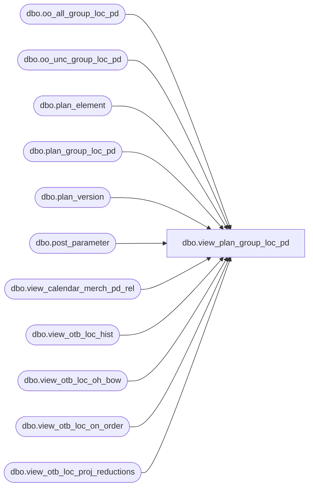

# dbo.view_plan_group_loc_pd

**Database:** ma_01  
**Server:** bedrockdb02  

## Architecture Diagram



## Table Dependencies

| Referenced Table |
|---|
| dbo.oo_all_group_loc_pd |
| dbo.oo_unc_group_loc_pd |
| dbo.plan_element |
| dbo.plan_group_loc_pd |
| dbo.plan_version |
| dbo.post_parameter |
| dbo.view_calendar_merch_pd_rel |
| dbo.view_otb_loc_hist |
| dbo.view_otb_loc_oh_bow |
| dbo.view_otb_loc_on_order |
| dbo.view_otb_loc_proj_reductions |

## View Code

```sql
create view dbo.view_plan_group_loc_pd 
AS
select  p.otb_element_id,a.hierarchy_group_id, a.merch_year_pd,a.location_id,
sum(a.plan_value * p.otb_operator) element_value,
sum(a.plan_local_value * p.otb_operator) element_local_value
from plan_group_loc_pd a, plan_element p , plan_version v
where
a.plan_element_id = p.plan_element_id
and p.otb_element_id is NOT NULL
and v.plan_version_id = a.plan_version_id
and v.current_plan_flag =1
group by p.otb_element_id, a.hierarchy_group_id,a.merch_year_pd,a.location_id
union all
select  p.otb_element_id +3,a.hierarchy_group_id,  d.merch_year_pd ,a.location_id,
sum(a.plan_value * p.otb_operator) element_value,
sum(a.plan_local_value * p.otb_operator) element_local_value
from plan_group_loc_pd a, plan_element p , plan_version v,
 view_calendar_merch_pd_rel c,view_calendar_merch_pd_rel d
where
p.otb_element_id between 7 and 10
and a.plan_element_id = p.plan_element_id
and p.otb_element_id is NOT NULL
and v.plan_version_id = a.plan_version_id
and v.current_plan_flag =1
and a.merch_year_pd = c.merch_year_pd
and c.relative_period = d.relative_period -1
group by p.otb_element_id, a.hierarchy_group_id,d.merch_year_pd,a.location_id
UNION ALL
select 13 otb_element,a.hierarchy_group_id , a.merch_year_pd,a.location_id, sum ( a.oh_bow_units + a.net_rcpt_wk_to_dt_units +
+ a.net_trsfrs_wk_to_dt_units + a.net_dist_wk_to_dt_units+ a.on_order_units
 - a.proj_reds_units) element_value,
 sum ( a.oh_bow_units + a.net_rcpt_wk_to_dt_units +
+ a.net_trsfrs_wk_to_dt_units + a.net_dist_wk_to_dt_units+ a.on_order_units
 - a.proj_reds_units) element_local_value
from  (select a.hierarchy_group_id, a.merch_year_pd, a.location_id,
ISNULL ( b.oh_bow_units,0)oh_bow_units,
ISNULL (c.net_rcpt_wk_to_dt_units,0)net_rcpt_wk_to_dt_units,
ISNULL (c.net_trsfrs_wk_to_dt_units,0) net_trsfrs_wk_to_dt_units,
ISNULL (c.net_dist_wk_to_dt_units,0)net_dist_wk_to_dt_units,
ISNULL (d.on_order_units,0)on_order_units,
ISNULL (e.proj_reds_units,0)proj_reds_units
from plan_group_loc_pd a
 left join view_otb_loc_oh_bow b
on a.hierarchy_group_id = b.hierarchy_group_id
and a.location_id = b.location_id
 left join view_otb_loc_hist c
on a.hierarchy_group_id = c.hierarchy_group_id
and a.location_id = c.location_id
 left join view_otb_loc_on_order d
on a.hierarchy_group_id = d.hierarchy_group_id
and a.merch_year_pd=d.merch_year_pd
and a.location_id = d.location_id
left join view_otb_loc_proj_reductions e
on a.hierarchy_group_id = e.hierarchy_group_id
and a.location_id = e.location_id
and a.merch_year_pd = e.merch_year_pd
group by a.hierarchy_group_id ,a.merch_year_pd, a.location_id,b.oh_bow_units,c.net_rcpt_wk_to_dt_units,
c.net_trsfrs_wk_to_dt_units,c.net_dist_wk_to_dt_units,d.on_order_units,
e.proj_reds_units) a ,post_parameter p
where p.parameter_id =11
and a.merch_year_pd >= parameter_value
group by a.hierarchy_group_id ,a.merch_year_pd, a.location_id
UNION ALL
select 14 otb_element,a.hierarchy_group_id , a.merch_year_pd,a.location_id, 
sum ( a.oh_bow_retail + a.net_rcpt_wk_to_dt_retail +
+ a.net_trsfrs_wk_to_dt_retail + a.net_dist_wk_to_dt_retail+ a.on_order_retail
 - a.proj_reds_retail) element_value,
sum ( a.oh_bow_retail_local + a.net_rcpt_wk_to_dt_retail_local +
+ a.net_trsfrs_wk_to_dt_retail_local + a.net_dist_wk_to_dt_retail_local+ a.on_order_retail_local
 - a.proj_reds_retail_local) element_local_value
from  (select a.hierarchy_group_id, a.merch_year_pd, a.location_id,
ISNULL ( b.oh_bow_retail,0)oh_bow_retail,
ISNULL ( b.oh_bow_retail_local,0)oh_bow_retail_local,
ISNULL (c.net_rcpt_wk_to_dt_retail,0)net_rcpt_wk_to_dt_retail,
ISNULL (c.net_rcpt_wk_to_dt_retail_local,0)net_rcpt_wk_to_dt_retail_local,
ISNULL (c.net_trsfrs_wk_to_dt_retail,0) net_trsfrs_wk_to_dt_retail,
ISNULL (c.net_trsfrs_wk_to_dt_retail_local,0) net_trsfrs_wk_to_dt_retail_local,
ISNULL (c.net_dist_wk_to_dt_retail,0)net_dist_wk_to_dt_retail,
ISNULL (c.net_dist_wk_to_dt_retail_local,0)net_dist_wk_to_dt_retail_local,
ISNULL (d.on_order_retail,0)on_order_retail,
ISNULL (d.on_order_retail_local,0)on_order_retail_local,
ISNULL (e.proj_reds_retail,0)proj_reds_retail,
ISNULL (e.proj_reds_retail_local,0)proj_reds_retail_local
from plan_group_loc_pd a
 left join view_otb_loc_oh_bow b
on a.hierarchy_group_id = b.hierarchy_group_id
and a.location_id = b.location_id
 left join view_otb_loc_hist c
on a.hierarchy_group_id = c.hierarchy_group_id
and a.location_id = c.location_id
 left join view_otb_loc_on_order d
on a.hierarchy_group_id = d.hierarchy_group_id
and a.merch_year_pd=d.merch_year_pd
and a.location_id = d.location_id
left join view_otb_loc_proj_reductions e
on a.hierarchy_group_id = e.hierarchy_group_id
and a.location_id = e.location_id
and a.merch_year_pd = e.merch_year_pd
group by a.hierarchy_group_id ,a.merch_year_pd,a.location_id, b.oh_bow_retail,b.oh_bow_retail_local,c.net_rcpt_wk_to_dt_retail,c.net_rcpt_wk_to_dt_retail_local,
c.net_trsfrs_wk_to_dt_retail, c.net_trsfrs_wk_to_dt_retail_local, c.net_dist_wk_to_dt_retail,c.net_dist_wk_to_dt_retail_local, d.on_order_retail, d.on_order_retail_local,
e.proj_reds_retail, e.proj_reds_retail_local) a ,post_parameter p
where p.parameter_id =11
and a.merch_year_pd >= parameter_value
group by a.hierarchy_group_id ,a.merch_year_pd, a.location_id
UNION ALL
select 15 otb_element,a.hierarchy_group_id , a.merch_year_pd,a.location_id, 
sum ( a.oh_bow_cost + a.net_rcpt_wk_to_dt_cost +
+ a.net_trsfrs_wk_to_dt_cost + a.net_dist_wk_to_dt_cost+ a.on_order_cost - a.proj_reds_cost) element_value,
sum ( a.oh_bow_cost_local + a.net_rcpt_wk_to_dt_cost_local +
+ a.net_trsfrs_wk_to_dt_cost_local + a.net_dist_wk_to_dt_cost_local+ a.on_order_cost_local - a.proj_reds_cost_local) element_local_value
from  (select a.hierarchy_group_id, a.merch_year_pd, a.location_id,
ISNULL ( b.oh_bow_cost,0)oh_bow_cost,
ISNULL ( b.oh_bow_cost_local,0)oh_bow_cost_local,
ISNULL (c.net_rcpt_wk_to_dt_cost,0)net_rcpt_wk_to_dt_cost,
ISNULL (c.net_rcpt_wk_to_dt_cost_local,0)net_rcpt_wk_to_dt_cost_local,
ISNULL (c.net_trsfrs_wk_to_dt_cost,0) net_trsfrs_wk_to_dt_cost,
ISNULL (c.net_trsfrs_wk_to_dt_cost_local,0) net_trsfrs_wk_to_dt_cost_local,
ISNULL (c.net_dist_wk_to_dt_cost,0)net_dist_wk_to_dt_cost,
ISNULL (c.net_dist_wk_to_dt_cost_local,0)net_dist_wk_to_dt_cost_local,
ISNULL (d.on_order_cost,0)on_order_cost,
ISNULL (d.on_order_cost_local,0)on_order_cost_local,
ISNULL (e.proj_reds_cost,0)proj_reds_cost,
ISNULL (e.proj_reds_cost_local,0)proj_reds_cost_local
from plan_group_loc_pd a
 left join view_otb_loc_oh_bow b
on a.hierarchy_group_id = b.hierarchy_group_id
and a.location_id = b.location_id
 left join view_otb_loc_hist c
on a.hierarchy_group_id = c.hierarchy_group_id
and a.location_id = c.location_id
 left join view_otb_loc_on_order d
on a.hierarchy_group_id = d.hierarchy_group_id
and a.merch_year_pd=d.merch_year_pd
and a.location_id = d.location_id
left join view_otb_loc_proj_reductions e
on a.hierarchy_group_id = e.hierarchy_group_id
and a.location_id = e.location_id
and a.merch_year_pd = e.merch_year_pd
group by a.hierarchy_group_id ,a.merch_year_pd,a.location_id, b.oh_bow_cost,b.oh_bow_cost_local,c.net_rcpt_wk_to_dt_cost,c.net_rcpt_wk_to_dt_cost_local,
c.net_trsfrs_wk_to_dt_cost,c.net_trsfrs_wk_to_dt_cost_local,c.net_dist_wk_to_dt_cost,c.net_dist_wk_to_dt_cost_local,d.on_order_cost,d.on_order_cost_local,
e.proj_reds_cost, e.proj_reds_cost_local) a ,post_parameter p
where p.parameter_id =11
and a.merch_year_pd >= parameter_value
group by a.hierarchy_group_id ,a.merch_year_pd, a.location_id
UNION ALL
select 16 otb_element,a.hierarchy_group_id , a.merch_year_pd,a.location_id, 
sum ( a.oh_bow_units + a.net_rcpt_wk_to_dt_units + a.net_trsfrs_wk_to_dt_units + a.net_dist_wk_to_dt_units+ a.allocation_units
 - a.proj_reds_units) element_value,
sum ( a.oh_bow_units + a.net_rcpt_wk_to_dt_units + a.net_trsfrs_wk_to_dt_units + a.net_dist_wk_to_dt_units+ a.allocation_units
 - a.proj_reds_units) element_local_value
from  (select a.hierarchy_group_id, a.merch_year_pd, a.location_id,
ISNULL ( b.oh_bow_units,0)oh_bow_units,
ISNULL (c.net_rcpt_wk_to_dt_units,0)net_rcpt_wk_to_dt_units,
ISNULL (c.net_trsfrs_wk_to_dt_units,0) net_trsfrs_wk_to_dt_units,
ISNULL (c.net_dist_wk_to_dt_units,0)net_dist_wk_to_dt_units,
ISNULL (d.allocation_units,0)allocation_units,
ISNULL (e.proj_reds_units,0)proj_reds_units
from plan_group_loc_pd a
 left join view_otb_loc_oh_bow b
on a.hierarchy_group_id = b.hierarchy_group_id
and a.location_id = b.location_id
 left join view_otb_loc_hist c
on a.hierarchy_group_id = c.hierarchy_group_id
and a.location_id = c.location_id
 left join view_otb_loc_on_order d
on a.hierarchy_group_id = d.hierarchy_group_id
and a.merch_year_pd=d.merch_year_pd
and a.location_id = d.location_id
left join view_otb_loc_proj_reductions e
on a.hierarchy_group_id = e.hierarchy_group_id
and a.location_id = e.location_id
and a.merch_year_pd = e.merch_year_pd
group by a.hierarchy_group_id ,a.merch_year_pd, a.location_id,b.oh_bow_units,c.net_rcpt_wk_to_dt_units,
c.net_trsfrs_wk_to_dt_units,c.net_dist_wk_to_dt_units,d.allocation_units,
e.proj_reds_units) a ,post_parameter p
where p.parameter_id =11
and a.merch_year_pd >= parameter_value
group by a.hierarchy_group_id ,a.merch_year_pd, a.location_id
UNION ALL
select 17 otb_element,a.hierarchy_group_id , a.merch_year_pd, a.location_id,
SUM (a.on_order_units) element_value,
SUM (a.on_order_units) element_local_value
from oo_all_group_loc_pd a
group by a.hierarchy_group_id, a.merch_year_pd, a.location_id
UNION ALL
select 18 otb_element,a.hierarchy_group_id , a.merch_year_pd, a.location_id, 
SUM (a.on_order_retail) element_value,
SUM (a.on_order_retail_local) element_local_value
from oo_all_group_loc_pd a
group by a.hierarchy_group_id, a.merch_year_pd, a.location_id
UNION ALL
select 19 otb_element,a.hierarchy_group_id , a.merch_year_pd, a.location_id, 
SUM (a.on_order_cost) element_value,
SUM (a.on_order_cost_local) element_local_value
from oo_all_group_loc_pd a
group by a.hierarchy_group_id, a.merch_year_pd, a.location_id
UNION ALL
select 20 otb_element,a.hierarchy_group_id , a.merch_year_pd,a.location_id, 
SUM (a.allocation_units) element_value,
SUM (a.allocation_units) element_local_value
from oo_all_group_loc_pd a
group by a.hierarchy_group_id, a.merch_year_pd, a.location_id
UNION ALL
select 21 otb_element,a.hierarchy_group_id , a.merch_year_pd, a.location_id,
SUM (a.on_order_units) element_value,
SUM (a.on_order_units) element_local_value
from oo_unc_group_loc_pd a
group by a.hierarchy_group_id, a.merch_year_pd, a.location_id
UNION ALL
select 22 otb_element,a.hierarchy_group_id , a.merch_year_pd, a.location_id, 
SUM (a.on_order_retail) element_value,
SUM (a.on_order_retail_local) element_local_value
from oo_unc_group_loc_pd a
group by a.hierarchy_group_id, a.merch_year_pd, a.location_id
UNION ALL
select 23 otb_element,a.hierarchy_group_id , a.merch_year_pd, a.location_id, 
SUM (a.on_order_cost) element_value,
SUM (a.on_order_cost_local) element_local_value
from oo_unc_group_loc_pd a
group by a.hierarchy_group_id, a.merch_year_pd, a.location_id
```

