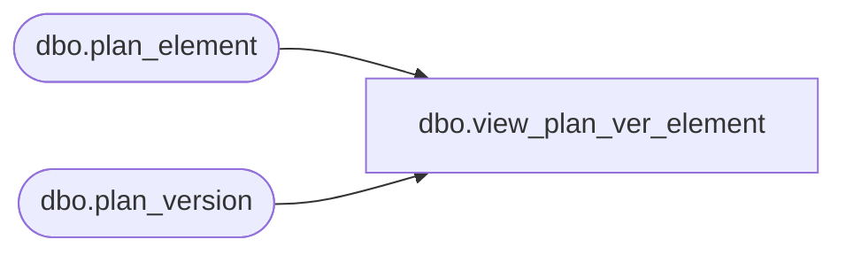

# dbo.view_plan_ver_element

**Database:** ma_01  
**Server:** bedrockdb02  

## Architecture Diagram



## Table Dependencies

| Referenced Table |
|---|
| dbo.plan_element |
| dbo.plan_version |

## View Code

```sql
create view [dbo].[view_plan_ver_element] 
(plan_ver_element_id,plan_ver_element_desc)
AS
SELECT a.plan_version_id * 100000 + b.plan_element_id plan_ver_element_id,
       a.plan_version_code + N'-' + b.plan_element_label  plan_ver_element_desc
FROM plan_version a, plan_element b
```

