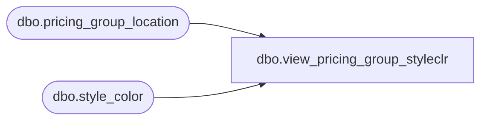

# dbo.view_pricing_group_styleclr

**Database:** ma_01  
**Server:** bedrockdb02  

## Architecture Diagram



## Table Dependencies

| Referenced Table |
|---|
| dbo.pricing_group_location |
| dbo.style_color |

## View Code

```sql
CREATE VIEW dbo.view_pricing_group_styleclr
AS
SELECT DISTINCT p.pricing_group_id, sc.style_color_id, sc.style_id, sc.color_id
FROM pricing_group_location p, style_color sc
```

