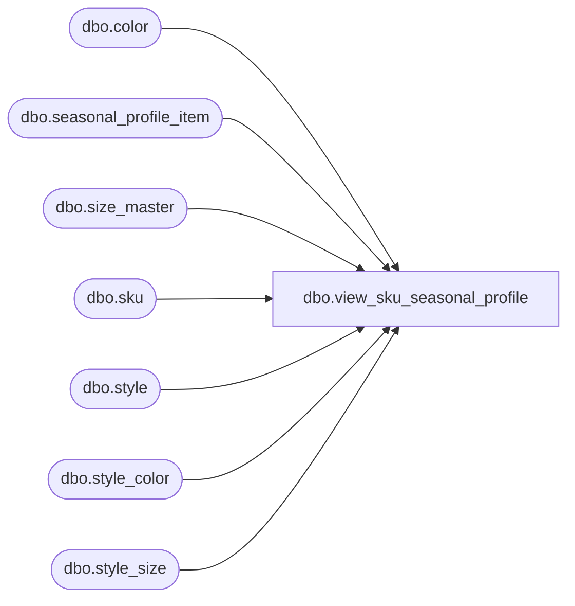

# dbo.view_sku_seasonal_profile

**Database:** ma_01  
**Server:** bedrockdb02  

## Architecture Diagram



## Table Dependencies

| Referenced Table |
|---|
| dbo.color |
| dbo.seasonal_profile_item |
| dbo.size_master |
| dbo.sku |
| dbo.style |
| dbo.style_color |
| dbo.style_size |

## View Code

```sql
create view dbo.view_sku_seasonal_profile
AS
SELECT DISTINCT
  sk.sku_id,
  sk.style_id,
  sk.color_id,
  sk.size_master_id,
  s.style_code,
  s.long_desc,
  s.short_desc,
  sc.long_desc style_color_long_desc, 
  sc.short_desc style_color_short_desc,
  c.color_code,
  c.color_long_description,
  c.color_short_description,
  sm.size_label,
  sm.prim_size_label,
  sm.sec_size_label
FROM sku sk
INNER JOIN style s
ON sk.style_id = s.style_id
INNER JOIN style_color sc
ON sk.color_id = sc.color_id
and sk.style_id = sc.style_id
INNER JOIN color c
ON sc.color_id = c.color_id
INNER JOIN style_size ss
ON sk.size_master_id = ss.size_master_id
INNER JOIN size_master sm
ON ss.size_master_id = sm.size_master_id
WHERE sk.sku_id in (SELECT DISTINCT sku_id FROM seasonal_profile_item)
```

