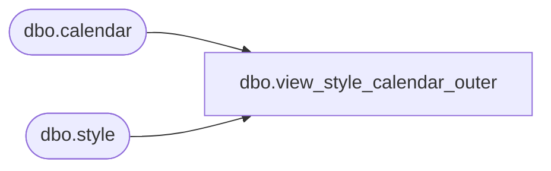

# dbo.view_style_calendar_outer

**Database:** ma_01  
**Server:** bedrockdb02  

## Architecture Diagram



## Table Dependencies

| Referenced Table |
|---|
| dbo.calendar |
| dbo.style |

## View Code

```sql
CREATE view dbo.view_style_calendar_outer 
as

SELECT s.style_id, s.calendar_id, ca.calendar_code
From style s
LEFT OUTER JOIN calendar ca 
ON s.calendar_id = ca.calendar_id
```

