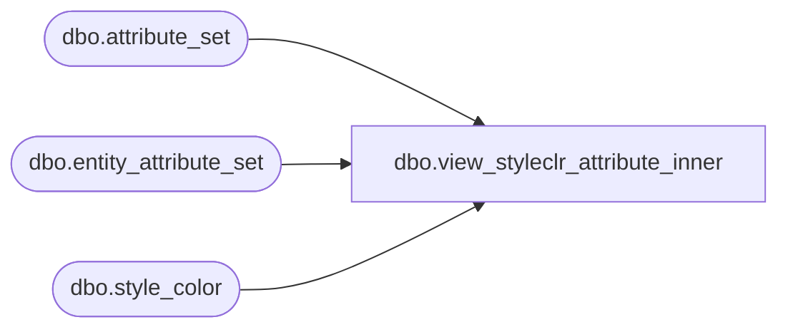

# dbo.view_styleclr_attribute_inner

**Database:** ma_01  
**Server:** bedrockdb02  

## Architecture Diagram



## Table Dependencies

| Referenced Table |
|---|
| dbo.attribute_set |
| dbo.entity_attribute_set |
| dbo.style_color |

## View Code

```sql
create view dbo.view_styleclr_attribute_inner AS    
  SELECT DISTINCT a.style_color_id,  
  a.style_id,
  a.color_id,
 b.attribute_set_id,
 b.attribute_set_code,
  b.attribute_set_label,  
  e.attribute_id 
   FROM entity_attribute_set e ,style_color a , attribute_set b
   where a.style_color_id =e.parent_id and e.parent_type =19
     and   e.attribute_set_id = b.attribute_set_id
```

