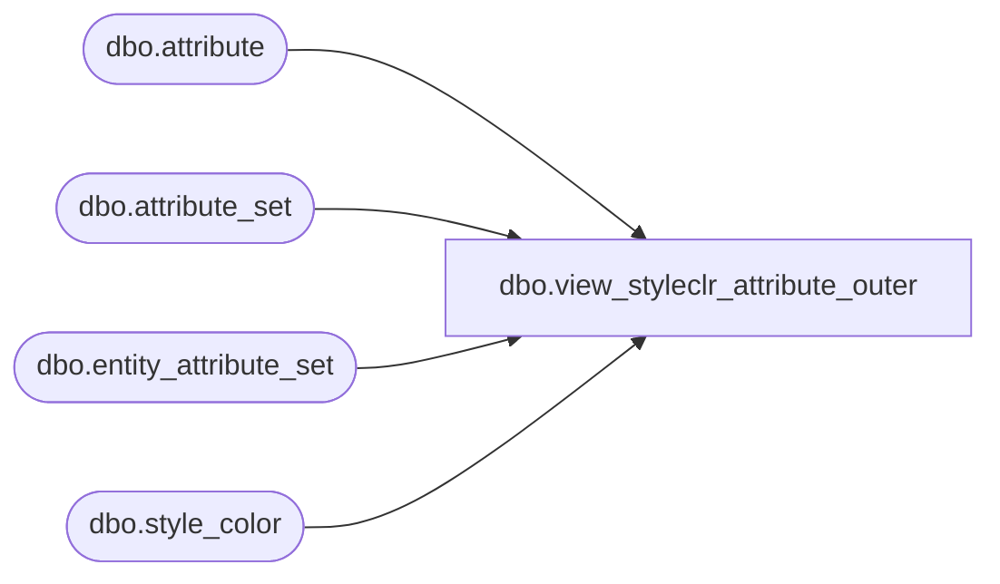

# dbo.view_styleclr_attribute_outer

**Database:** ma_01  
**Server:** bedrockdb02  

## Architecture Diagram



## Table Dependencies

| Referenced Table |
|---|
| dbo.attribute |
| dbo.attribute_set |
| dbo.entity_attribute_set |
| dbo.style_color |

## View Code

```sql
create view dbo.view_styleclr_attribute_outer AS
SELECT g.style_color_id,g.style_id, g.color_id,{fn IFNULL(f.attribute_set_id,-1)}attribute_set_id,f.attribute_set_code, f.attribute_set_label,g.attribute_id
FROM
  (  SELECT DISTINCT a.style_color_id,
                     a.style_id,
                     a.color_id,        
                     b.attribute_set_id,
                     b.attribute_set_code,
                     b.attribute_set_label,
                     e.attribute_id
     FROM entity_attribute_set e
     RIGHT JOIN style_color a 
on a.style_color_id =e.parent_id  and e.parent_type =19
 LEFT JOIN attribute_set b     
   on  e.attribute_set_id = b.attribute_set_id) f 
   RIGHT JOIN
  (  SELECT DISTINCT
           a.style_color_id,
           a.style_id,
           a.color_id, 
       NULL attribute_set_code, 
           e.attribute_id
     FROM attribute e ,style_color a
     WHERE e.attribute_type= 19) g
on
 f.style_color_id = g.style_color_id
 AND f.style_id = g.style_id
 AND f.color_id = g.color_id
  and (f.attribute_id = g.attribute_id
   or f.attribute_id IS NULL)
```

