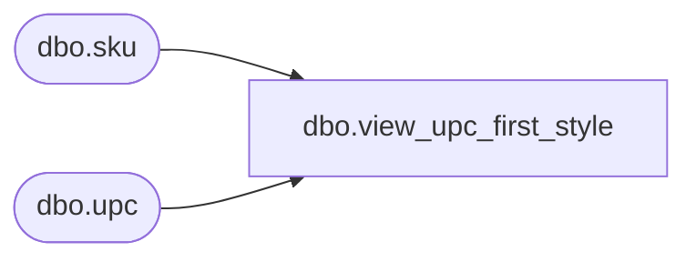

# dbo.view_upc_first_style

**Database:** ma_01  
**Server:** bedrockdb02  

## Architecture Diagram



## Table Dependencies

| Referenced Table |
|---|
| dbo.sku |
| dbo.upc |

## View Code

```sql
create view dbo.view_upc_first_style as
select  a.style_id, min(c.upc_number) upc_number
from sku a, upc c 
where a.sku_id =c.sku_id
group by a.style_id
```

