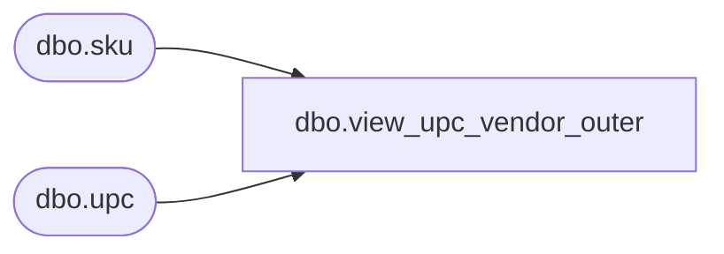

# dbo.view_upc_vendor_outer

**Database:** ma_01  
**Server:** bedrockdb02  

## Architecture Diagram



## Table Dependencies

| Referenced Table |
|---|
| dbo.sku |
| dbo.upc |

## View Code

```sql
create view [dbo].[view_upc_vendor_outer] AS
SELECT
       k.sku_id
       ,u.upc_number
FROM
       dbo.sku k
       LEFT JOIN

              (
                     SELECT
                           u.sku_id
                           ,MAX (CONVERT (VARCHAR (19), u.last_activity_date, 121) + '|~|' + CONVERT (VARCHAR (20), u.upc_id)) AS max_join_key
                     FROM
                           dbo.upc u
                     WHERE
                           u.upc_type = 1
                     GROUP BY
                           u.sku_id
              ) sqMAX ON sqMAX.sku_id = k.sku_id

       LEFT JOIN dbo.upc u on u.last_activity_date = LEFT (sqMAX.max_join_key, 19)
              AND u.upc_id = SUBSTRING (sqMAX.max_join_key, CHARINDEX ('|~|', sqMAX.max_join_key) + 3, LEN (sqMAX.max_join_key))
              AND u.upc_type = 1
```

