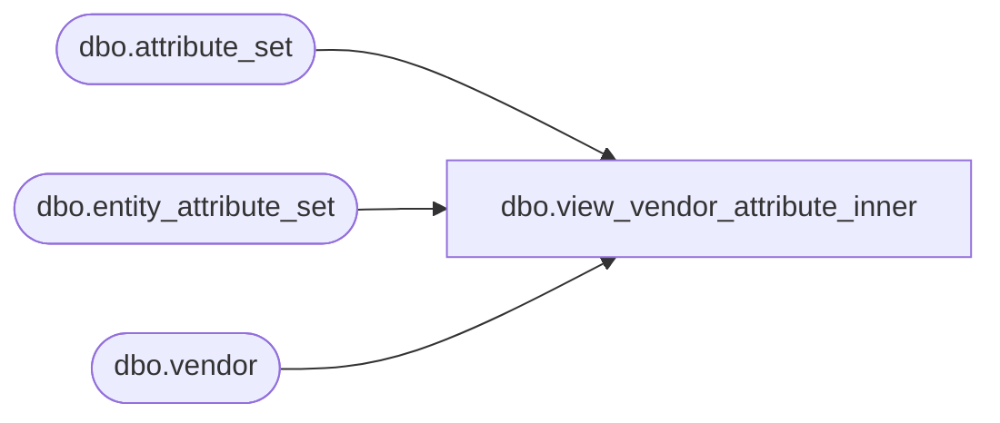

# dbo.view_vendor_attribute_inner

**Database:** ma_01  
**Server:** bedrockdb02  

## Architecture Diagram



## Table Dependencies

| Referenced Table |
|---|
| dbo.attribute_set |
| dbo.entity_attribute_set |
| dbo.vendor |

## View Code

```sql
create view dbo.view_vendor_attribute_inner  AS
   SELECT DISTINCT a.vendor_id,  
  b.attribute_set_id,
   b.attribute_set_code, 
   b.attribute_set_label,   
  e.attribute_id 
   FROM entity_attribute_set e, vendor a ,
    attribute_set b
    where e.attribute_set_id = b.attribute_set_id
    and a.vendor_id =e.parent_id  and e.parent_type =3
```

