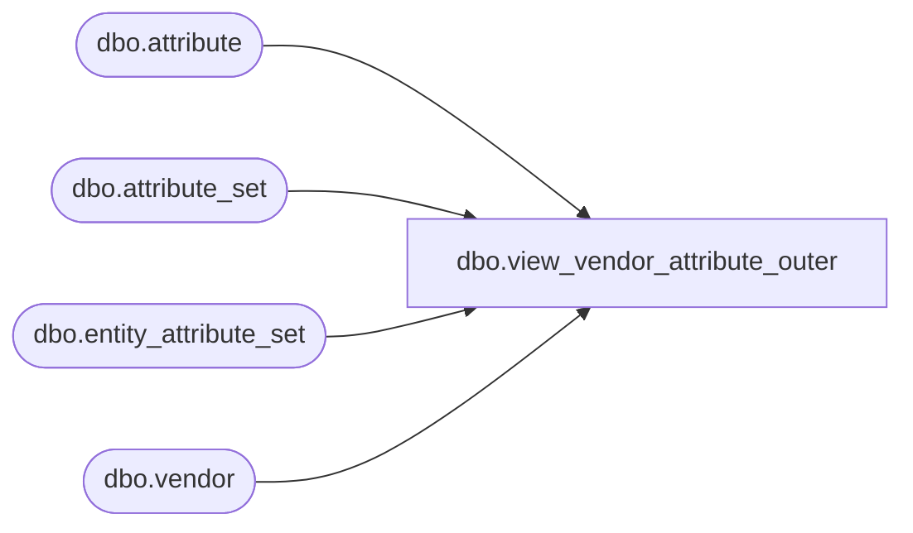

# dbo.view_vendor_attribute_outer

**Database:** ma_01  
**Server:** bedrockdb02  

## Architecture Diagram



## Table Dependencies

| Referenced Table |
|---|
| dbo.attribute |
| dbo.attribute_set |
| dbo.entity_attribute_set |
| dbo.vendor |

## View Code

```sql
create view dbo.view_vendor_attribute_outer  AS
   select g.vendor_id,{fn IFNULL(f.attribute_set_id,-1)} attribute_set_id,
   f.attribute_set_code, f.attribute_set_label,g.attribute_id
  from     
  (  SELECT DISTINCT a.vendor_id,  
 {fn IFNULL(b.attribute_set_id,-1)} attribute_set_id,
   b.attribute_set_code, 
   b.attribute_set_label,   
  e.attribute_id 
   FROM entity_attribute_set e RIGHT JOIN vendor a 
    on a.vendor_id =e.parent_id and e.parent_type =3
     LEFT JOIN  attribute_set b
     on e.attribute_set_id = b.attribute_set_id ) f 
     RIGHT JOIN
  ( SELECT DISTINCT  
  a.vendor_id, 
  NULL attribute_set_code,
  e.attribute_id 
   FROM attribute e ,vendor a
   where e.attribute_type=3) g
   on
    f.vendor_id = g.vendor_id
   and (f.attribute_id = g.attribute_id
   or f.attribute_id is NULL)
```

