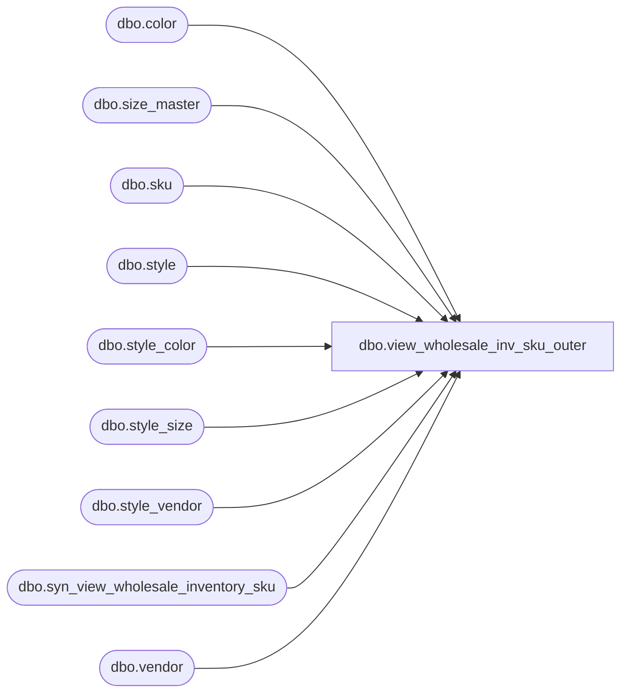

# dbo.view_wholesale_inv_sku_outer

**Database:** ma_01  
**Server:** bedrockdb02  

## Architecture Diagram



## Table Dependencies

| Referenced Table |
|---|
| dbo.color |
| dbo.size_master |
| dbo.sku |
| dbo.style |
| dbo.style_color |
| dbo.style_size |
| dbo.style_vendor |
| dbo.syn_view_wholesale_inventory_sku |
| dbo.vendor |

## View Code

```sql
create view dbo.view_wholesale_inv_sku_outer 

AS
SELECT 
sv.style_vendor_id,
s.style_id, 
sc.style_color_id,
c.color_id,
sm.size_master_id,
sm.size_label,
k.sku_id, 
ISNULL(wi.available_on_hand, 0) AS available_on_hand,
ISNULL(wi.original_available_on_hand, 0) AS original_available_on_hand
FROM style s
INNER JOIN style_vendor sv on sv.style_id = s.style_id
INNER JOIN vendor v on v.vendor_id = sv.vendor_id 
INNER JOIN style_color sc on s.style_id = sc.style_id
INNER JOIN color c ON c.color_id = sc.color_id
INNER JOIN style_size sz ON sz.style_id = s.style_id AND sc.style_id = sz.style_id
INNER JOIN size_master sm ON sm.size_master_id = sz.size_master_id
INNER JOIN sku k ON k.style_id = s.style_id AND k.color_id = sc.color_id AND k.size_master_id = sm.size_master_id
LEFT OUTER JOIN syn_view_wholesale_inventory_sku wi ON wi.sku_id = k.sku_id and v.vendor_id = wi.vendor_id
```

