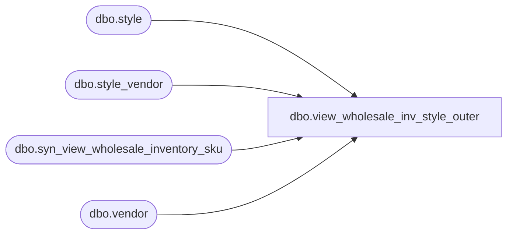

# dbo.view_wholesale_inv_style_outer

**Database:** ma_01  
**Server:** bedrockdb02  

## Architecture Diagram



## Table Dependencies

| Referenced Table |
|---|
| dbo.style |
| dbo.style_vendor |
| dbo.syn_view_wholesale_inventory_sku |
| dbo.vendor |

## View Code

```sql
create view dbo.view_wholesale_inv_style_outer 

AS
SELECT
sv.style_vendor_id, 
s.style_id, 
SUM(ISNULL(wi.available_on_hand, 0)) AS available_on_hand,
SUM(ISNULL(wi.original_available_on_hand, 0)) AS original_available_on_hand
FROM style s
INNER JOIN style_vendor sv on sv.style_id = s.style_id
INNER JOIN vendor v on v.vendor_id = sv.vendor_id
LEFT OUTER JOIN syn_view_wholesale_inventory_sku wi ON wi.style_code = s.style_code and wi.vendor_id = sv.vendor_id 
group by sv.style_vendor_id, s.style_id
```

