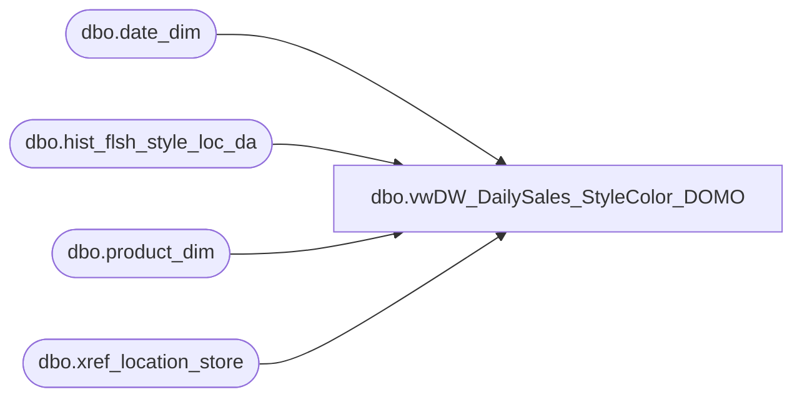

# dbo.vwDW_DailySales_StyleColor_DOMO

**Database:** ma_01  
**Server:** bedrockdb02  

## Architecture Diagram



## Table Dependencies

| Referenced Table |
|---|
| dbo.date_dim |
| dbo.hist_flsh_style_loc_da |
| dbo.product_dim |
| dbo.xref_location_store |

## View Code

```sql
CREATE view [dbo].[vwDW_DailySales_StyleColor_DOMO] 

as

--=============================================================================================================================================================
-- Dan Tweedie - 2016-08-31 - Joins are same as existing view vwDW_WeeklySales_StyleColor_biapp01, which is the view that feeds the cube. (except date_dim since there is no merch_year_wk key)
--								This new view is for staging data to push to DOMO.
--=============================================================================================================================================================

with vw as
	(
		SELECT 
			cast(dd.year as varchar) + cast(fiscal_week as varchar) as merch_year_wk,
			CAST(ISNULL(xp.product_key, xpsoly.product_key) AS varchar) AS product_key,
			CAST(xs.store_key AS varchar) AS store_key,
			dd.date_key as date_key,
			sum(isnull(sales.sales_net_units, 0)) sales_net_units ,
			sum(isnull(sales.sales_net_cost,0)) sales_net_cost,
			sum(isnull(sales.sales_net_retail_te,0)) sales_net_retail_te

		FROM
			dbo.hist_flsh_style_loc_da sales WITH (NOLOCK)
			INNER JOIN dw_mirror.dbo.xref_location_store xs WITH (NOLOCK)
				ON sales.location_id = xs.location_id
			INNER JOIN dw_mirror.dbo.date_dim dd WITH (NOLOCK) on cast(sales.sales_date as date) = cast(dd.actual_date as date)
			LEFT JOIN (SELECT
					pd.style_id,
					pd.jurisdiction_id,
					MIN(pd.product_key) AS product_key
				FROM
					dw_mirror.dbo.product_dim pd WITH (NOLOCK)
				GROUP BY	pd.style_id,
							pd.jurisdiction_id) xp
				ON sales.style_id = xp.style_id
				AND xs.jurisdiction_id = xp.jurisdiction_id
			LEFT JOIN (SELECT
					pd.style_id,
					MIN(pd.product_key) AS product_key
				FROM
					dw_mirror.dbo.product_dim pd WITH (NOLOCK)
				GROUP BY pd.style_id) xpsoly
				ON sales.style_id = xpsoly.style_id
		Group by 
			cast(dd.year as varchar) + cast(fiscal_week as varchar),
			CAST(ISNULL(xp.product_key, xpsoly.product_key) AS varchar),
			CAST(xs.store_key AS varchar),
			dd.date_key
	)
SELECT
	vw.merch_year_wk,
	vw.product_key,
	vw.store_key,
	vw.date_key,
	vw.sales_net_units,
	vw.sales_net_cost,
	vw.sales_net_retail_te
FROM vw
```

