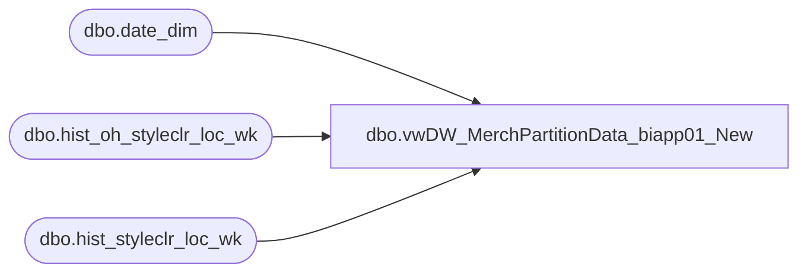

# dbo.vwDW_MerchPartitionData_biapp01_New

**Database:** ma_01  
**Server:** bedrockdb02  

## Architecture Diagram



## Table Dependencies

| Referenced Table |
|---|
| dbo.date_dim |
| dbo.hist_oh_styleclr_loc_wk |
| dbo.hist_styleclr_loc_wk |

## View Code

```sql
CREATE VIEW [dbo].[vwDW_MerchPartitionData_biapp01_New]
AS

	SELECT 'BAB DW' AS DataSourceID, 'Merchandising' AS CubeName, 'Papa Mart 1' AS CubeID, 
			'Weekly On Hand' AS MeasureGroup, 'Vw DW Weekly On Hand Style Color' AS MeasureGroupID, 
			CAST(d.fiscal_year AS varchar) + '_' + RIGHT('0' + CAST(d.fiscal_period AS varchar), 2) AS Partition,
			--'SELECT [dbo].[vwDW_WeeklyOnHand_StyleColor].[product_key],[dbo].[vwDW_WeeklyOnHand_StyleColor].[store_key],[dbo].[vwDW_WeeklyOnHand_StyleColor].[date_key],[dbo].[vwDW_WeeklyOnHand_StyleColor].[inventory_status_id],[dbo].[vwDW_WeeklyOnHand_StyleColor].[price_status_id],[dbo].[vwDW_WeeklyOnHand_StyleColor].[on_hand_units],[dbo].[vwDW_WeeklyOnHand_StyleColor].[on_hand_retail]    FROM [dbo].[vwDW_WeeklyOnHand_StyleColor] WITH (NOLOCK) WHERE merch_year_wk BETWEEN ' + CAST(min_week AS varchar) + ' AND ' + CAST(max_week AS varchar) + ' ' AS SQL,
			'SELECT * FROM [dbo].[vwDW_WeeklyOnHand_StyleColor_biapp01] WITH (NOLOCK) WHERE merch_year_wk BETWEEN ' + CAST(min_week AS varchar) + ' AND ' + CAST(max_week AS varchar) + ' ' AS SQL,
			CAST(d.min_week AS varchar) AS min_week,
			CAST(d.max_week AS varchar) AS max_week,
			CASE
				WHEN d.period_id > d.current_period_id - 2 THEN 1
				ELSE 0
			END AS ProcessFlag,
			'831535' AS EstimatedRows,
			'AggOnHand' AS AggregationDesignID
	FROM
		(SELECT fiscal_year, fiscal_period, period_id,
			(SELECT fiscal_year FROM dw_mirror.dbo.date_dim WITH (NOLOCK) WHERE actual_date = convert(datetime, convert(char(10), getdate(), 101))) AS current_fiscal_year,
			(SELECT fiscal_period FROM dw_mirror.dbo.date_dim WITH (NOLOCK) WHERE actual_date = convert(datetime, convert(char(10), getdate(), 101))) AS current_fiscal_period,
			(SELECT period_id FROM dw_mirror.dbo.date_dim WITH (NOLOCK) WHERE actual_date = convert(datetime, convert(char(10), getdate(), 101))) AS current_period_id,
			(SELECT CAST(CAST(MAX(fiscal_year) AS varchar) + RIGHT('0' + CAST(MIN(fiscal_week) AS varchar), 2) AS int) FROM dw_mirror.dbo.date_dim d2 WITH (NOLOCK) WHERE d2.fiscal_year = d.fiscal_year AND d2.fiscal_period = d.fiscal_period) min_week,
			(SELECT CAST(CAST(MAX(fiscal_year) AS varchar) + RIGHT('0' + CAST(MAX(fiscal_week) AS varchar), 2) AS int) FROM dw_mirror.dbo.date_dim d2 WITH (NOLOCK) WHERE d2.fiscal_year = d.fiscal_year AND d2.fiscal_period = d.fiscal_period) max_week
		FROM (SELECT DISTINCT fiscal_year, fiscal_period, period_id FROM dw_mirror.dbo.date_dim WITH (NOLOCK) WHERE date_key >= (SELECT MIN(date_key) FROM dw_mirror.dbo.date_dim d WITH (NOLOCK) WHERE fiscal_year = (SELECT fiscal_year - 1 FROM dw_mirror.dbo.date_dim d2 WITH (NOLOCK) WHERE actual_date = convert(datetime, convert(char(10), getdate(), 101))))) d) d
	WHERE EXISTS (SELECT TOP 1 *
					FROM hist_oh_styleclr_loc_wk
					WHERE merch_year_wk BETWEEN min_week AND max_week)

/*	-- No Longer Used
	UNION

	SELECT 'BAB DW' AS DataSourceID, 'Merchandising' AS CubeName, 'Papa Mart 1' AS CubeID, 
			'Weekly On Hand for Cost' AS MeasureGroup, 'Vw DW Weekly On Hand Style' AS MeasureGroupID, 
			CAST(d.fiscal_year AS varchar) + '_' + RIGHT('0' + CAST(d.fiscal_period AS varchar), 2) AS Partition,
			'SELECT [dbo].[vwDW_WeeklyOnHand_Style].[product_key],[dbo].[vwDW_WeeklyOnHand_Style].[store_key],[dbo].[vwDW_WeeklyOnHand_Style].[date_key],[dbo].[vwDW_WeeklyOnHand_Style].[inventory_status_id],[dbo].[vwDW_WeeklyOnHand_Style].[price_status_id],[dbo].[vwDW_WeeklyOnHand_Style].[on_hand_cost]    FROM [dbo].[vwDW_WeeklyOnHand_Style] WITH (NOLOCK) WHERE merch_year_wk BETWEEN ' + CAST(min_week AS varchar) + ' AND ' + CAST(max_week AS varchar) + ' ' AS SQL,
			CAST(d.min_week AS varchar) AS min_week,
			CAST(d.max_week AS varchar) AS max_week,
			CASE
				WHEN d.period_id > d.current_period_id - 2 THEN 1
				ELSE 0
			END AS ProcessFlag,
			'1074757' AS EstimatedRows,
			'AggregationDesign' AS AggregationDesignID
	FROM
		(SELECT fiscal_year, fiscal_period, period_id,
			(SELECT fiscal_year FROM dw_mirror.dbo.date_dim WITH (NOLOCK) WHERE actual_date = convert(datetime, convert(char(10), getdate(), 101))) AS current_fiscal_year,
			(SELECT fiscal_period FROM dw_mirror.dbo.date_dim WITH (NOLOCK) WHERE actual_date = convert(datetime, convert(char(10), getdate(), 101))) AS current_fiscal_period,
			(SELECT period_id FROM dw_mirror.dbo.date_dim WITH (NOLOCK) WHERE actual_date = convert(datetime, convert(char(10), getdate(), 101))) AS current_period_id,
			(SELECT CAST(CAST(MAX(fiscal_year) AS varchar) + RIGHT('0' + CAST(MIN(fiscal_week) AS varchar), 2) AS int) FROM dw_mirror.dbo.date_dim d2 WITH (NOLOCK) WHERE d2.fiscal_year = d.fiscal_year AND d2.fiscal_period = d.fiscal_period) min_week,
			(SELECT CAST(CAST(MAX(fiscal_year) AS varchar) + RIGHT('0' + CAST(MAX(fiscal_week) AS varchar), 2) AS int) FROM dw_mirror.dbo.date_dim d2 WITH (NOLOCK) WHERE d2.fiscal_year = d.fiscal_year AND d2.fiscal_period = d.fiscal_period) max_week
		FROM (SELECT DISTINCT fiscal_year, fiscal_period, period_id FROM dw_mirror.dbo.date_dim WITH (NOLOCK) WHERE date_key >= (SELECT MIN(date_key) FROM dw_mirror.dbo.date_dim d WITH (NOLOCK) WHERE fiscal_year = (SELECT fiscal_year - 1 FROM dw_mirror.dbo.date_dim d2 WITH (NOLOCK) WHERE actual_date = convert(datetime, convert(char(10), getdate(), 101))))) d) d
	WHERE EXISTS (SELECT TOP 1 *
					FROM hist_oh_style_loc_wk
					WHERE merch_year_wk BETWEEN min_week AND max_week)
*/
	UNION

	SELECT 'BAB DW' AS DataSourceID, 'Merchandising' AS CubeName, 'Papa Mart 1' AS CubeID, 
			'Weekly Sales' AS MeasureGroup, 'Vw DW Weekly Sales Style Color' AS MeasureGroupID, 
			CAST(d.fiscal_year AS varchar) + '_' + RIGHT('0' + CAST(d.fiscal_period AS varchar), 2) AS Partition,
			--'SELECT [dbo].[vwDW_WeeklySales_StyleColor].[product_key],[dbo].[vwDW_WeeklySales_StyleColor].[store_key],[dbo].[vwDW_WeeklySales_StyleColor].[date_key],[dbo].[vwDW_WeeklySales_StyleColor].[perm_md_retail],[dbo].[vwDW_WeeklySales_StyleColor].[perm_mu_retail],[dbo].[vwDW_WeeklySales_StyleColor].[perm_mdc_retail],[dbo].[vwDW_WeeklySales_StyleColor].[perm_muc_retail],[dbo].[vwDW_WeeklySales_StyleColor].[promo_pc_total_retail],[dbo].[vwDW_WeeklySales_StyleColor].[received_units],[dbo].[vwDW_WeeklySales_StyleColor].[received_retail],[dbo].[vwDW_WeeklySales_StyleColor].[return_to_vendor_units],[dbo].[vwDW_WeeklySales_StyleColor].[return_to_vendor_retail],[dbo].[vwDW_WeeklySales_StyleColor].[distributions_units],[dbo].[vwDW_WeeklySales_StyleColor].[distributions_retail],[dbo].[vwDW_WeeklySales_StyleColor].[transfer_in_units],[dbo].[vwDW_WeeklySales_StyleColor].[transfer_in_retail],[dbo].[vwDW_WeeklySales_StyleColor].[transfer_out_units],[dbo].[vwDW_WeeklySales_StyleColor].[transfer_out_retail],[dbo].[vwDW_WeeklySales_StyleColor].[sales_total_units],[dbo].[vwDW_WeeklySales_StyleColor].[sales_total_retail],[dbo].[vwDW_WeeklySales_StyleColor].[return_units],[dbo].[vwDW_WeeklySales_StyleColor].[return_retail],[dbo].[vwDW_WeeklySales_StyleColor].[shrink_actual_units],[dbo].[vwDW_WeeklySales_StyleColor].[shrink_actual_retail],[dbo].[vwDW_WeeklySales_StyleColor].[adjustments_total_units],[dbo].[vwDW_WeeklySales_StyleColor].[adjustments_total_retail],[dbo].[vwDW_WeeklySales_StyleColor].[sales_total_cost],[dbo].[vwDW_WeeklySales_StyleColor].[return_cost]    FROM [dbo].[vwDW_WeeklySales_StyleColor] WITH (NOLOCK) WHERE merch_year_wk BETWEEN ' + CAST(min_week AS varchar) + ' AND ' + CAST(max_week AS varchar) + ' ' AS SQL,
			'SELECT * FROM [dbo].[vwDW_WeeklySales_StyleColor_biapp01] WITH (NOLOCK) WHERE merch_year_wk BETWEEN ' + CAST(min_week AS varchar) + ' AND ' + CAST(max_week AS varchar) + ' ' AS SQL,
			CAST(d.min_week AS varchar) AS min_week,
			CAST(d.max_week AS varchar) AS max_week,
			CASE
				WHEN d.period_id > d.current_period_id - 2 THEN 1
				ELSE 0
			END AS ProcessFlag,
			'382246' AS EstimatedRows,
			'AggWeeklySales' AS AggregationDesignID
	FROM
		(SELECT fiscal_year, fiscal_period, period_id,
			(SELECT fiscal_year FROM dw_mirror.dbo.date_dim WITH (NOLOCK) WHERE actual_date = convert(datetime, convert(char(10), getdate(), 101))) AS current_fiscal_year,
			(SELECT fiscal_period FROM dw_mirror.dbo.date_dim WITH (NOLOCK) WHERE actual_date = convert(datetime, convert(char(10), getdate(), 101))) AS current_fiscal_period,
			(SELECT period_id FROM dw_mirror.dbo.date_dim WITH (NOLOCK) WHERE actual_date = convert(datetime, convert(char(10), getdate(), 101))) AS current_period_id,
			(SELECT CAST(CAST(MAX(fiscal_year) AS varchar) + RIGHT('0' + CAST(MIN(fiscal_week) AS varchar), 2) AS int) FROM dw_mirror.dbo.date_dim d2 WITH (NOLOCK) WHERE d2.fiscal_year = d.fiscal_year AND d2.fiscal_period = d.fiscal_period) min_week,
			(SELECT CAST(CAST(MAX(fiscal_year) AS varchar) + RIGHT('0' + CAST(MAX(fiscal_week) AS varchar), 2) AS int) FROM dw_mirror.dbo.date_dim d2 WITH (NOLOCK) WHERE d2.fiscal_year = d.fiscal_year AND d2.fiscal_period = d.fiscal_period) max_week
		FROM (SELECT DISTINCT fiscal_year, fiscal_period, period_id FROM dw_mirror.dbo.date_dim WITH (NOLOCK) WHERE date_key >= (SELECT MIN(date_key) FROM dw_mirror.dbo.date_dim d WITH (NOLOCK) WHERE fiscal_year = (SELECT fiscal_year - 1 FROM dw_mirror.dbo.date_dim d2 WITH (NOLOCK) WHERE actual_date = convert(datetime, convert(char(10), getdate(), 101))))) d) d
	WHERE EXISTS (SELECT TOP 1 *
					FROM hist_styleclr_loc_wk
					WHERE merch_year_wk BETWEEN min_week AND max_week)


dbo,vwDW_WeeklyAlloc_StyleColor,CREATE VIEW [dbo].[vwDW_WeeklyAlloc_StyleColor]
AS

--select top 5 * from ma_01.dbo.oo_all_styleclr_loc_wk where allocation_units > 0
select 
	STYLE_CODE, COLOR_CODE, LOCATION_CODE,
 	(CAST(p.product_key AS varchar)) AS product_key
		,s.store_key
		,d.date_key
		 ,oaslw.merch_year_wk
        , oaslw.allocation_units

from  ma_01.dbo.oo_all_styleclr_loc_wk oaslw  WITH (NOLOCK)
INNER JOIN dbo.location l  WITH (NOLOCK) ON l.location_id = oaslw.location_id
INNER JOIN dw_mirror.dbo.vwDW_Store s WITH (NOLOCK)
		ON s.store_id = CAST(CAST(l.location_code AS int) AS varchar)
INNER JOIN dbo.style style  WITH (NOLOCK) ON style.style_id = oaslw.style_id
INNER JOIN dbo.sku WITH (NOLOCK)
		ON sku.style_id = oaslw.style_id
			and sku.color_id = oaslw.color_id
	LEFT JOIN dbo.upc  WITH (NOLOCK) ON upc_id = (SELECT TOP 1 u2.upc_id
											FROM upc u2 WITH (NOLOCK)
											WHERE u2.sku_id = sku.sku_id
												AND u2.upc_number < '000001000000')
												/*AND u2.upc_number = '000000' + style.style_code*/
LEFT JOIN dbo.color c  WITH (NOLOCK) on c.color_id = oaslw.color_id
LEFT JOIN dw_mirror.dbo.product_dim p WITH (NOLOCK)
		ON p.style_id =  oaslw.style_id
		AND p.color_id =  oaslw.color_id

LEFT JOIN dw_mirror.dbo.date_dim d WITH (NOLOCK)
		ON d.fiscal_year = CAST(SUBSTRING(CAST(OASLW.merch_year_wk AS varchar), 1, 4) AS int)
		AND fiscal_week = CAST(SUBSTRING(CAST(OASLW.merch_year_wk AS varchar), 5, 2) AS int)
		AND day_of_week = 7


--	where sku.style_id = 13243 and sku.color_id = 1
--	and location_code = 2019 and allocation_units > 0
```

