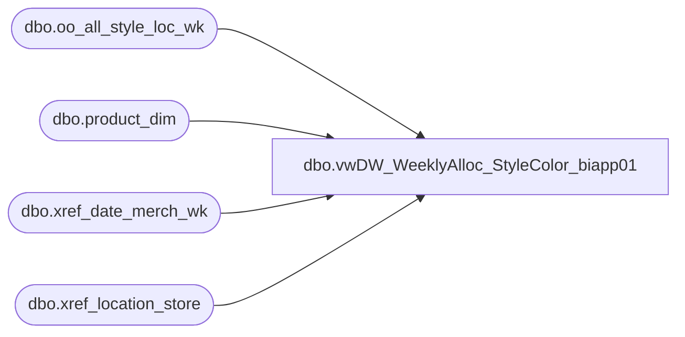

# dbo.vwDW_WeeklyAlloc_StyleColor_biapp01

**Database:** ma_01  
**Server:** bedrockdb02  

## Architecture Diagram



## Table Dependencies

| Referenced Table |
|---|
| dbo.oo_all_style_loc_wk |
| dbo.product_dim |
| dbo.xref_date_merch_wk |
| dbo.xref_location_store |

## View Code

```sql
/*
	This is used to get the allocations for the cube

G Murrish		3/1/2013		Changed lookup of product_key to handle the problems with R-B-Z products which go across 
								multiple jurisdictions
*/

CREATE VIEW [dbo].[vwDW_WeeklyAlloc_StyleColor_biapp01]
AS
SELECT
	CAST('' AS varchar) AS STYLE_CODE,
	CAST('' AS varchar) AS COLOR_CODE,
	CAST('' AS varchar) AS LOCATION_CODE,
	CAST(ISNULL(xp.product_key, xpsoly.product_key) AS varchar) AS product_key,
	CAST(xs.store_key AS varchar) AS store_key,
	xd.date_key,
	oo.merch_year_wk
	-- facts
	,
	oo.allocation_units
FROM
	dbo.oo_all_style_loc_wk oo WITH (NOLOCK)
	INNER JOIN dw_mirror.dbo.xref_location_store xs WITH (NOLOCK)
		ON oo.location_id = xs.location_id
	LEFT JOIN (SELECT
			pd.style_id,
			pd.jurisdiction_id,
			MIN(pd.product_key) AS product_key
		FROM
			dw_mirror.dbo.product_dim pd WITH (NOLOCK)
		GROUP BY	pd.style_id,
			pd.jurisdiction_id)
			xp
		ON oo.style_id = xp.style_id
		AND xs.jurisdiction_id = xp.jurisdiction_id
	LEFT JOIN (SELECT
			pd.style_id,
			MIN(pd.product_key) AS product_key
		FROM
			dw_mirror.dbo.product_dim pd WITH (NOLOCK)
		GROUP BY	pd.style_id)
			xpsoly
		ON oo.style_id = xpsoly.style_id
	INNER JOIN dw_mirror.dbo.xref_date_merch_wk xd WITH (NOLOCK)
		ON oo.merch_year_wk = xd.merch_year_wk;
```

