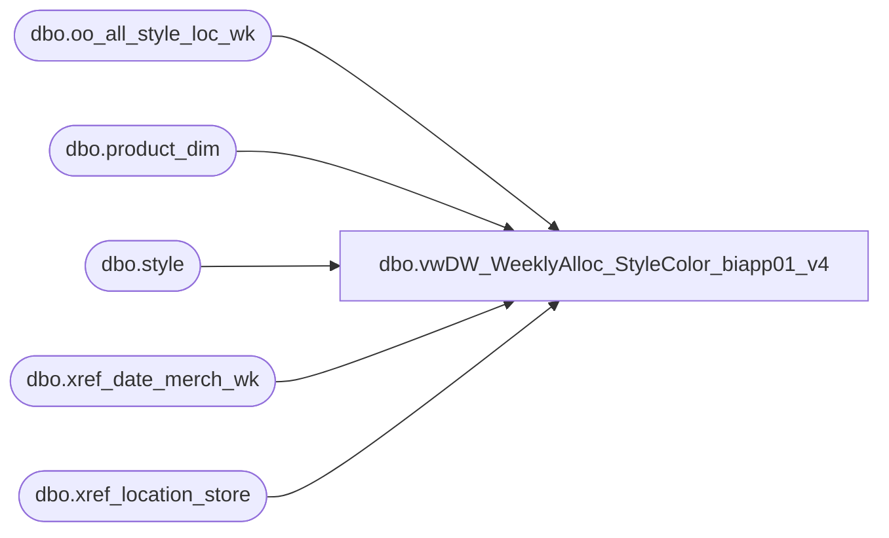

# dbo.vwDW_WeeklyAlloc_StyleColor_biapp01_v4

**Database:** ma_01  
**Server:** bedrockdb02  

## Architecture Diagram



## Table Dependencies

| Referenced Table |
|---|
| dbo.oo_all_style_loc_wk |
| dbo.product_dim |
| dbo.style |
| dbo.xref_date_merch_wk |
| dbo.xref_location_store |

## View Code

```sql
/*
	This is used to get the allocations for the cube

G Murrish		3/1/2013		Changed lookup of product_key to handle the problems with R-B-Z products which go across 
								multiple jurisdictions
*/

CREATE VIEW [dbo].[vwDW_WeeklyAlloc_StyleColor_biapp01_v4]
AS
SELECT
	--CAST('' AS varchar) AS STYLE_CODE,
	s.style_code AS STYLE_CODE,
	xs.jurisdiction_code,

	CASE
    WHEN xs.jurisdiction_code = 'US' THEN 1100
    WHEN xs.jurisdiction_code = 'CA' THEN 1700
    WHEN xs.jurisdiction_code IN ('UK','IE') THEN 2110
    WHEN xs.jurisdiction_code = 'CN' THEN 3001
    ELSE NULL
END AS LegalEntity,


	CAST('' AS varchar) AS COLOR_CODE,
	CAST('' AS varchar) AS LOCATION_CODE,
	--CAST(ISNULL(xp.product_key, xpsoly.product_key) AS varchar) AS product_key,
	CAST(xs.store_key AS varchar) AS store_key,
	xd.date_key,
	oo.merch_year_wk
	-- facts
	,
	oo.allocation_units
FROM
	dbo.oo_all_style_loc_wk oo WITH (NOLOCK)
	join style s on oo.style_id = s.style_id
	INNER JOIN dw_mirror.dbo.xref_location_store xs WITH (NOLOCK)
		ON oo.location_id = xs.location_id
	LEFT JOIN (SELECT
			pd.style_id,
			pd.jurisdiction_id,
			MIN(pd.product_key) AS product_key
		FROM
			dw_mirror.dbo.product_dim pd WITH (NOLOCK)
		GROUP BY	pd.style_id,
			pd.jurisdiction_id)
			xp
		ON oo.style_id = xp.style_id
		AND xs.jurisdiction_id = xp.jurisdiction_id
	LEFT JOIN (SELECT
			pd.style_id,
			MIN(pd.product_key) AS product_key
		FROM
			dw_mirror.dbo.product_dim pd WITH (NOLOCK)
		GROUP BY	pd.style_id)
			xpsoly
		ON oo.style_id = xpsoly.style_id
	INNER JOIN dw_mirror.dbo.xref_date_merch_wk xd WITH (NOLOCK)
		ON oo.merch_year_wk = xd.merch_year_wk;

		--where s.style_code like '4%';


dbo,vwDW_WeeklyAlloc_StyleColor_Orig,Create VIEW [dbo].[vwDW_WeeklyAlloc_StyleColor_Orig]
AS

		 

select      s.style_code, 

            c.color_code,

            l.location_code,

            oaslw.merch_year_wk,

            oaslw.allocation_units

from  ma_01.dbo.oo_all_styleclr_loc_wk oaslw,

            style s,

            color c,

            location l

where oaslw.style_id = s.style_id

and         oaslw.color_id = c.color_id

and         oaslw.location_id = l.location_id


dbo,vwDW_WeeklyOnHand_Style, CREATE VIEW [dbo].[vwDW_WeeklyOnHand_Style]
AS

-- =============================================================================================================
-- Name: [dbo].[vwDW_WeeklyOnHand_Style]
--
-- Description: View underlying the SSAS Merchandising Cube used on the dashboard.   
-- Aggregates Weekly On Hand information by Style 
---- Creates dummy products by concatenating subclass_code and style_code 
--
-- Joins dbo.dbo.hist_oh_styleclr_loc_wk and dbo.location to
-- dw_mirror.dbo.vwDW_Store, dw_mirror.dbo.product_dim and dw_mirror.dbo.date_dim

-- Dependencies: 
--
-- Revision History
--		Name:					Date:			Comments:


--		Funmi Agbebi			4/30/2010		dw_mirror.dbo.product_dim.jurisdiction_id pulled in 
--												jurisdiction_id added to product_key for dummy products 
--												with introduction of products into the R-B-Z division
--		Outside Consultant		2006			original creation
-- =============================================================================================================


	SELECT

		-- dimension keys
		--	Commented out 4/30/2010 (FA )
--		,p.subclass_code + '-' + p.style_code AS product_key 
		-- Additional fields starts (FA - 4/30/2010)
		p.subclass_code + '-' + p.style_code + '-' + cast(l.jurisdiction_id as varchar(2)) AS product_key
		,p.jurisdiction_id as product_jurisdiction_id
		,l.jurisdiction_id as location_jurisdiction_id
		-- Additional fields ends (FA - 4/30/2010)

		,s.store_key
		,d.date_key
		,oh.inventory_status_id
		,oh.price_status_id

		,oh.merch_year_wk
		,oh.style_id
		,oh.location_id

		-- facts
		,oh.on_hand_cost
--		, isnull(ia.available_to_distribute,oh.on_hand_units) * sv.current_cost as on_hand_cost
--			,oh.on_hand_cost as on_hand_cost_old
--			,oh.on_hand_units
--			,ia.available_to_distribute
--			,sv.current_cost
--			,p.subclass_code
--			,p.style_code

	FROM dbo.hist_oh_style_loc_wk oh  WITH (NOLOCK)
	INNER JOIN dbo.location l  WITH (NOLOCK) ON l.location_id = oh.location_id
	INNER JOIN dw_mirror.dbo.vwDW_Store s  WITH (NOLOCK) ON s.store_id = CAST(CAST(l.location_code AS int) AS varchar)
	LEFT JOIN dw_mirror.dbo.product_dim p  WITH (NOLOCK) ON p.product_key = (SELECT TOP 1 p2.product_key FROM dw_mirror.dbo.product_dim p2  WITH (NOLOCK) WHERE p2.style_id = oh.style_id)
	LEFT JOIN dw_mirror.dbo.date_dim d  WITH (NOLOCK) ON d.fiscal_year = CAST(SUBSTRING(CAST(oh.merch_year_wk AS varchar), 1, 4) AS int)
		AND fiscal_week = CAST(SUBSTRING(CAST(oh.merch_year_wk AS varchar), 5, 2) AS int)
		AND day_of_week = 7

	/*
	inner join style_vendor sv
		on sv.style_id = oh.style_id
			and sv.primary_vendor_flag = 1
	left join (select sku.style_id
					, ia.location_id
					, sum(iit.total_on_hand_units) - sum(ia.allocated_units) as available_to_distribute
					from me_01..ib_inventory_total iit
					inner join me_01..ib_allocation ia
						on ia.sku_id = iit.sku_id
					inner join me_01..distribution d
						on d.distribution_number = ia.allocation_number
							and d.location_id = iit.location_id
					inner join location l
						on l.location_id = iit.location_id
					inner join dbo.sku sku
						on sku.sku_id = iit.sku_id
					where iit.inventory_status_id = 1
						and l.location_code in ('0980','0975','2970') --'0980' US Warehouse, '0975' = Canada, '2970' = UK
						and isnull(d.po_id,0) = 0
						and isnull(d.advance_shipping_notice_id,0) = 0
					group by sku.style_id
						, ia.location_id) ia
		on ia.style_id = oh.style_id
			and ia.location_id = oh.location_id
	*/
```

