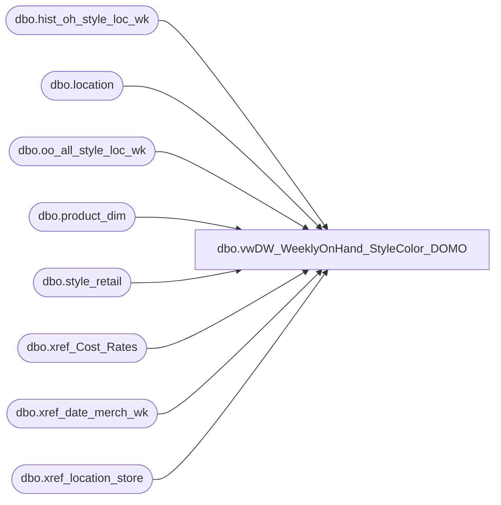

# dbo.vwDW_WeeklyOnHand_StyleColor_DOMO

**Database:** ma_01  
**Server:** bedrockdb02  

## Architecture Diagram



## Table Dependencies

| Referenced Table |
|---|
| dbo.hist_oh_style_loc_wk |
| dbo.location |
| dbo.oo_all_style_loc_wk |
| dbo.product_dim |
| dbo.style_retail |
| dbo.xref_Cost_Rates |
| dbo.xref_date_merch_wk |
| dbo.xref_location_store |

## View Code

```sql
CREATE VIEW [dbo].[vwDW_WeeklyOnHand_StyleColor_DOMO]

AS

--=============================================================================================================================================================
-- Dan Tweedie - 2016-08-31 - Created view as modified version of existing view vwDW_WeeklyOnHand_StyleColor_biapp01, which is the view that feeds the cube.
--								This new view is for staging data to push to DOMO.
--=============================================================================================================================================================
WITH vw as
	(
		SELECT
			CAST(ISNULL(xp.product_key, xpsoly.product_key) AS varchar) AS product_key,
			CAST(xs.store_key AS varchar) AS store_key,
			xd.date_key,
			oh.merch_year_wk,
			sum(isnull(oh.on_hand_units,0)) as on_hand_units,
			sum(isnull(oh.on_hand_retail_te,0)) AS on_hand_retail_te,
			sum(isnull(oh.on_hand_cost,0)) AS on_hand_cost
		FROM
			dbo.hist_oh_style_loc_wk oh WITH (NOLOCK)
			INNER JOIN dbo.location l WITH (NOLOCK)
				ON l.location_id = oh.location_id
			INNER JOIN style_retail sr WITH (NOLOCK)
				ON sr.style_id = oh.style_id
				AND sr.jurisdiction_id = l.jurisdiction_id
			LEFT JOIN oo_all_style_loc_wk oo WITH (NOLOCK)
				ON oo.style_id = oh.style_id
				AND oo.location_id = oh.location_id
				AND oo.merch_year_wk = oh.merch_year_wk
			INNER JOIN dw_mirror.dbo.xref_location_store xs WITH (NOLOCK)
				ON oh.location_id = xs.location_id
			LEFT JOIN (SELECT
					pd.style_id,
					pd.jurisdiction_id,
					MIN(pd.product_key) AS product_key
				FROM
					dw_mirror.dbo.product_dim pd WITH (NOLOCK)
				GROUP BY	pd.style_id,
					pd.jurisdiction_id
			) xp
				ON oh.style_id = xp.style_id
				AND xs.jurisdiction_id = xp.jurisdiction_id
			LEFT JOIN (SELECT
					pd.style_id,
					MIN(pd.product_key) AS product_key
				FROM
					dw_mirror.dbo.product_dim pd WITH (NOLOCK)
				GROUP BY	pd.style_id
			) xpsoly
				ON oh.style_id = xpsoly.style_id
			INNER JOIN dw_mirror.dbo.xref_date_merch_wk xd WITH (NOLOCK)
				ON oh.merch_year_wk = xd.merch_year_wk
			LEFT JOIN dw_mirror.dbo.xref_Cost_Rates xchange
				ON xchange.jurisdiction_id = xs.jurisdiction_id
				AND xchange.weekKey = oh.merch_year_wk 
		group by CAST(ISNULL(xp.product_key, xpsoly.product_key) AS varchar),
			CAST(xs.store_key AS varchar),
			xd.date_key,
			oh.merch_year_wk
	)
SELECT
	vw.product_key,
	vw.store_key,
	vw.date_key,
	vw.merch_year_wk,
	vw.on_hand_units,
	vw.on_hand_retail_te,
	vw.on_hand_cost
FROM vw
```

